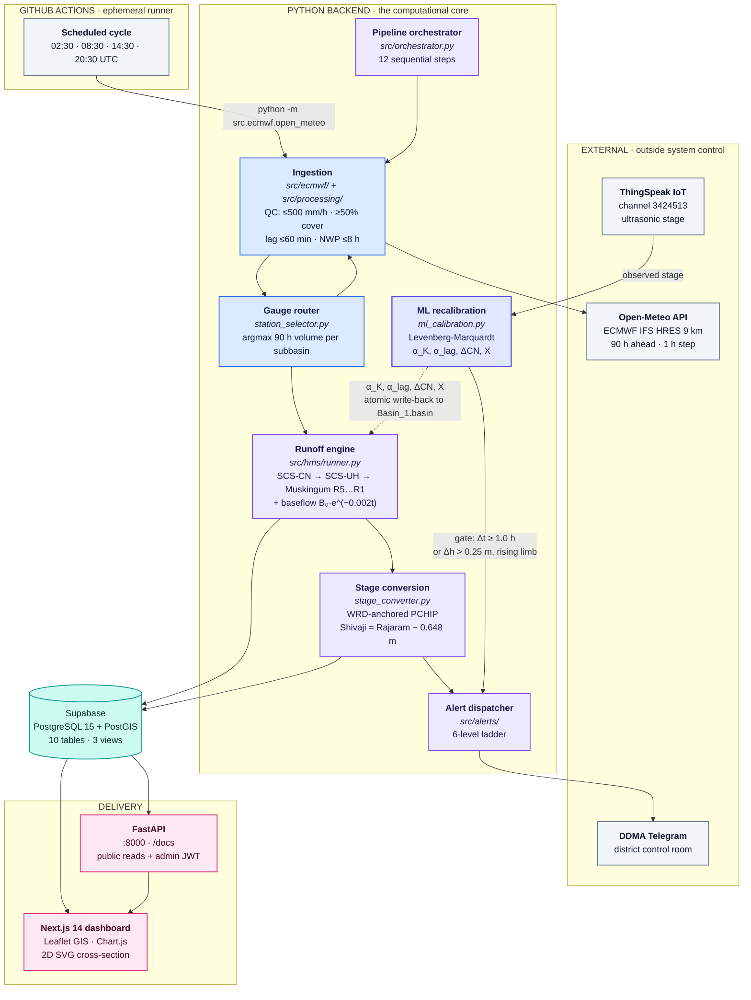

# HydroCast — Rainfall-Runoff & Flood Intelligence System
## System Architecture Specification v3.0 (Operational Release)

---

## 1. Cloud Infrastructure & System Architecture



The flow above is drawn at the module level. The
[Architecture Atlas](docs/architecture-atlas.md) carries the same system with
every governing equation, threshold and fallback branch annotated on the nodes —
start there if you want the engineering rather than the component inventory.

---

## 2. Detailed System Topology

The two figures below are the same system at two different altitudes. The
first is a component map: it answers "which module talks to which". The second
is a layer map: it answers "what happens to the water, in what order". Neither
carries the governing equations — for those, see
[Atlas §4](docs/architecture-atlas.md#4-loss-transform-and-routing).


```
====================================================================================================
                     PANCHGANGA HYDROCAST - END-TO-END SYSTEM TOPOLOGY
====================================================================================================

   [ ECMWF 9km HRES IFS ]                    [ ThingSpeak IoT Channel 3424513 ]
  (20 Station Precipitation)                 (Shivaji Bridge Ultrasonic Level)
              |                                              |
              v                                              v
   +----------------------+                       +----------------------+
   | Open-Meteo SDK Client|                       | Telemetry Validator  |
   | - 90h Hyetographs    |                       | - Quality Control    |
   +----------------------+                       +----------------------+
              |                                              |
              +----------------------+-----------------------+
                                     |
                                     v
                 +---------------------------------------+
                 |  Adaptive Physics-Informed ML Engine  |
                 |  - Discrepancy Detection (Delta_t)    |
                 |  - Scipy Levenberg-Marquardt Loss Minimization   |
                 +---------------------------------------+
                                     |
                                     v
                 +---------------------------------------+
                 |    HEC-HMS 4.13 Hydrological Core     |
                 |  - Loss: SCS Curve Number (AMC-I/II/III)|
                 |  - Transform: SCS Unit Hydrograph (UH)|
                 |  - Channel Routing: Muskingum (R1–R5) |
                 |  - Baseflow: Exponential Recession    |
                 +---------------------------------------+
                                     |
                                     v
                 +---------------------------------------+
                 |   2D Surveyed Hydraulic Rating Engine |
                 |  - Divided Channel Method (DCM)       |
                 |  - Main: n=0.031 | Overbank: n=0.070  |
                 |  - Bed Gradient & Backwater Transfer  |
                 +---------------------------------------+
                                     |
                   +-----------------+-----------------+
                   |                                   |
                   v                                   v
   +-------------------------------+   +-------------------------------+
   | Supabase PostgreSQL DB        |   | Next.js 14 Dashboard & SWR    |
   | - Single-Tree Relational Store|   | - GIS Leaflet Map             |
   | - Parquet Cold Storage Archival   | - 2D Cross-Section Viewer     |
   |   (src/db/archive_runs.py)    |   | - Adaptive ML Calibration Tab |
   +-------------------------------+   | - Serverless Telegram Webhook |
                   |                   +-------------------------------+
                   v                                   |
   +-------------------------------+                   v
   | DDMA Emergency Alert Engine   |   +-------------------------------+
   | - Telegram Bot Push Bulletins |   | Interactive Telegram Chatbot  |
   | - CWC Threshold Dispatcher    |   | - /status, /stage, /alerts    |
   +-------------------------------+   +-------------------------------+
```


HydroCast is an enterprise-grade operational hydrologic forecasting and early warning platform engineered specifically for the **$1,837.21\text{ km}^2$ gauged Panchganga River Basin** in Western Maharashtra, India. The platform couples numerical weather prediction, physical watershed routing, calibrated river hydraulics, real-time IoT radar telemetry, and closed-loop machine learning parameter recalibration into an autonomous 90-hour predictive continuum.

```
┌────────────────────────────────────────────────────────────────────────────────────────────────────────┐
│                                 1. METEOROLOGICAL INGESTION LAYER                                      │
│  Open-Meteo REST API / ECMWF IFS HRES (9 km Grid) ──> 90-Hour Forward Quantitative Precipitation (QPF) │
│  Exponential Backoff & Jitter Wrappers (src/ecmwf/retry_utils.py) ──> Physical Range & NaN QC Checks   │
└───────────────────────────────────────────────────┬────────────────────────────────────────────────────┘
                                                    │
                                                    ▼
┌────────────────────────────────────────────────────────────────────────────────────────────────────────┐
│                                 2. SPATIAL TOPOLOGY & SOIL MOISTURE LAYER                              │
│  20 Panchganga Stations (Karveer, Gaganbawda...) ──> Dynamic Conservative Maximum-Rainfall Selector     │
│  90h Forecast Rain Signal ──> Dynamic SCS Curve Number (AMC-I / AMC-II / AMC-III)                 │
└───────────────────────────────────────────────────┬────────────────────────────────────────────────────┘
                                                    │
                                                    ▼
┌────────────────────────────────────────────────────────────────────────────────────────────────────────┐
│                                 3. HYDROLOGICAL RUNOFF ENGINE LAYER                                    │
│  Calibrated Pure-Python SCS-CN / SCS-UH / Muskingum emulator is the production path on Linux.      │
│  A native HEC-HMS 4.x headless batch run is attempted when the Windows binary is present, but its    │
│  Run_1.dss is never parsed — every published number comes from the emulator.                        │
│  Subbasins S1–S9 Loss & Convolution ──> Reach Routing (R1–R5) ──> Sink Outlet Hydrograph (J_Outlet)   │
└───────────────────────────────────────────────────┬────────────────────────────────────────────────────┘
                                                    │
                                                    ▼
┌────────────────────────────────────────────────────────────────────────────────────────────────────────┐
│                                 4. WRD-ANCHORED HYDRAULIC RATING ENGINE                                   │
│  Monotonic PCHIP Rating (dQ/dh > 0) anchored on the official WRD Stage-Discharge Sheet               │
│  (Rajaram: sheet verbatim; Shivaji: sheet −0.648 m on sheet pts; + per-site WRD 2021–23 low-flow anchors)  │
│  Sheet Range: 530.18m Datum to 545.33m HFL Benchmark (3,850 m³/s)                                      │
└───────────────────────────────────────────────────┬────────────────────────────────────────────────────┘
                                                    │
                                                    ▼
┌────────────────────────────────────────────────────────────────────────────────────────────────────────┐
│                           5. REAL-TIME ML ADAPTIVE RECALIBRATION & CONFIDENCE BAND                     │
│  Discrepancy Detection vs ThingSpeak Ultrasonic Telemetry (|Δt| ≥ 1.0h or Δh > 0.25m)                  │
│  Levenberg-Marquardt Optimization: Muskingum α_K, Subbasin α_lag, ΔCN, Muskingum X ──> Basin_1.basin is  │
│  the single source of truth; recalibration writes back atomically to a .bak snapshot. │
│  Peak Flood Arrival Window Calculation: T_peak ± 2.0h (95% Confidence Interval) at Shivaji & Rajaram   │
└───────────────────────────────────────────────────┬────────────────────────────────────────────────────┘
                                                    │
                                                    ▼
┌────────────────────────────────────────────────────────────────────────────────────────────────────────┐
│                                 6. PERSISTENCE, COLD STORAGE & SECURITY                                │
│  Transactional Relational: PostgreSQL 15 / Supabase with asyncpg Pool & Step Logging                   │
│  Cold Storage Parquet Archival (src/db/archive_runs.py): 90-day columnar pruning into Snappy Parquet   │
│  Enterprise Security (src/api/security.py): HMAC-SHA256 JWT Admin + slowapi Rate Limiting (100 req/min)│
└───────────────────────────────────────────────────┬────────────────────────────────────────────────────┘
                                                    │
                                                    ▼
┌────────────────────────────────────────────────────────────────────────────────────────────────────────┐
│                                 7. ALERTING & DECISION SUPPORT LAYER                                   │
│  DDMA Multi-Channel Telegram Bot Dispatcher (src/alerts/telegram_bot.py) + Agency Webhooks             │
│  WebSocket Live Push (/ws/live) ──> Next.js 14 Responsive Dashboard (Chart.js, Leaflet, 2D SVG X-Sec) │
│  Peak Strike Horizon Card ──> 1-Click Run Ledger Inspector ──> Dual-Unit (m MSL / ft) Prediction Log   │
└────────────────────────────────────────────────────────────────────────────────────────────────────────┘
```

---

## 2. Technology Stack & Component Inventory

| Layer | Technology | Operational Function |
|---|---|---|
| **NWP Meteorological Data** | ECMWF IFS HRES 9km (0.1°), Open-Meteo REST API | Quantitative precipitation forecast (90 hours, 1-hr step) |
| **Ingestion Resilience** | Python `requests`, `openmeteo-requests`, SQLite Cache | Exponential backoff, full jitter, physical rainfall bounds (250 mm/hr) |
| **Hydrological Engine** | Calibrated Pure-Python Emulator (HEC-HMS 4.x attempted, never parsed) | Loss (SCS-CN), Transform (SCS-UH), Channel Routing (Muskingum) |
| **Hydraulic Rating** | SciPy PCHIP (`scipy.interpolate.PchipInterpolator`) | Strictly monotonic rating curves ($dQ/dh > 0$), surveyed bed slopes |
| **Real-Time ML Recalibration** | SciPy `optimize.least_squares` (Levenberg-Marquardt), NumPy | Dynamic optimization of $\alpha_K$, $\alpha_{\text{lag}}$, $\Delta\text{CN}$, $X$ based on ThingSpeak telemetry |
| **IoT Level Telemetry** | MathWorks ThingSpeak (Channel 3424513) | Solar-powered ultrasonic sensor at Shivaji Bridge deck ($549.35\text{ m MSL}$) |
| **Database & Spatial** | PostgreSQL 15 + PostGIS + Supabase Pooler | Master cycle runs, hyetographs, hydrographs, step logs |
| **Cold Storage Archival** | PyArrow + Apache Parquet (Snappy compression) | Columnar pruning of high-frequency telemetry older than 90 days |
| **API Backend** | FastAPI 0.111+, Starlette, Uvicorn, asyncpg | RESTful endpoints, async connection pool, WebSocket live push |
| **API Security & Limits** | PyJWT (HS256), `slowapi` (Limiter), constant-time HMAC | Dual-mode auth (Bearer JWT / Master API Key), 100 req/min rate limit |
| **Emergency Alerting** | Telegram Bot API (`python-telegram-bot`), HTTP Webhooks | Automated CWC/DDMA flood bulletins to district control room & SDRF |
| **Executive UI Dashboard** | Next.js 14 (App Router, SSR), React 18, Tailwind CSS | High-density operations dashboard, Leaflet GIS map, Chart.js, SVG X-Section |
| **Containerization** | Docker, Docker Compose | Multi-stage backend container (Python 3.12 + OpenJDK 17 + GDAL), standalone Next.js container |
| **Automation & CI/CD** | GitHub Actions workflows | 6-hourly operational runs + 1-hourly ThingSpeak verification |

---

## 3. The 12-Step Automated Pipeline Continuum

The orchestrator ([`src/orchestrator.py`](file:///e:/hydrocast_complete/src/orchestrator.py), [`src/ecmwf/open_meteo.py`](file:///e:/hydrocast_complete/src/ecmwf/open_meteo.py)) executes the following transactional sequence on every 6-hour cycle (00z, 06z, 12z, 18z):

```
┌─────────────────────────────────────────────────────────────────────────────────────────────────────────┐
│  STEP 1: METEOROLOGICAL FORCING INGESTION                                                               │
│    Query Open-Meteo ECMWF IFS HRES 9km API with exponential backoff & full jitter (retry_utils.py).     │
│    Sanitize NaNs, enforce non-negative bounds, clip anomalies (> 250 mm/hr), pad to 90 hours.            │
│                                                                                                         │
│  STEP 2: GAUGE FETCHING & SPATIAL STATION ROUTING                                                       │
│    Ingest 20 rain gauge nodes across 9 subbasins. Evaluate cumulative volume.                           │
│    Dynamic conservative router selects maximum-threat station as governing hyetograph per subbasin.     │
│                                                                                                         │
│  STEP 3: ANTECEDENT SOIL MOISTURE (AMC) CLASSIFICATION                                                  │
│    Classify wetness from mean 90h forecast rain (AMC-I <25, II 25-65, III >=65 mm).                     │
│    Dynamically adjust SCS Curve Numbers between AMC-I (dry), AMC-II (normal), and AMC-III (saturated).   │
│                                                                                                         │
│  STEP 4: HEC-DSS METEOROLOGICAL BOUNDARY PREPARATION                                                    │
│    Generate per-gauge DSS input tables (//<GAGE>/PRECIP-INC/<date>/1HOUR/GAGE/) into HMS_Automation_RJKT.dss.│
│                                                                                                         │
│  STEP 5: REAL-TIME ML ADAPTIVE RECALIBRATION CHECK                                                      │
│    Pull live ThingSpeak radar telemetry (Channel 3424513). Check previous cycle hydrograph vs observed. │
│    If |Δt| ≥ 1.0h or Δh > 0.25m: solve Levenberg-Marquardt residuals for α_K, α_lag, ΔCN, Muskingum X.       │
│    Backed-up atomic write-back to Basin_1.basin; current run also uses in-memory parameter overrides.  │
│                                                                                                         │
│  STEP 6: HYDROLOGICAL WATERSHED RUNOFF EXECUTION                                                        │
│    Attempt USACE HEC-HMS 4.x headless batch run (Control_1.control + Basin_1.basin + Met_1.met) when  │
│    the Windows binary is present, 300 s timeout. Fall back to the calibrated pure-Python SCS-CN /      │
│    SCS-UH / Muskingum emulator (< 20 ms) on a missing binary, non-zero exit, or timeout.               │
│    Note: Run_1.dss is never parsed, so the reported numbers are the emulator's either way.            │
│                                                                                                         │
│  STEP 7: SINK OUTLET HYDROGRAPH EXTRACTION                                                              │
│    Extract the 352-point discharge hydrograph at basin sink (J_Outlet); the 90-hour forecast horizon │
│    is sliced later. Calculate peak Q = argmax Q_total, Tp, and volume.                                  │
│                                                                                                         │
│  STEP 8: MONOTONIC HYDRAULIC RATING STAGE CONVERSION                                                    │
│    Evaluate WRD-anchored PCHIP rating curves (dQ/dh > 0): Rajaram = official WRD sheet verbatim;        │
│    Shivaji = same sheet shifted −0.648 m downstream datum (sheet points only; below  │
│    ~20 m³/s the per-site WRD register governs). Produce 90 hourly stage and Q.      │
│                                                                                                         │
│  STEP 9: PEAK FLOOD STRIKE HORIZON & CONFIDENCE INTERVAL COMPUTATION                                    │
│    Calculate peak arrival time and permissible ±2.0h uncertainty window (95% CI) at Shivaji and Rajaram.│
│    Compute 95% stage confidence envelope (±0.12m to ±0.35m) and discharge band (±6% rating tolerance).  │
│                                                                                                         │
│  STEP 10: REAL-TIME ACCURACY & VALIDATION AUDITING                                                      │
│    Compute Spearman rank correlation (ρ), Nash-Sutcliffe Efficiency (NSE), RMSE, MAE, and PBIAS.        │
│    Audit 20-station rainfall volumetric fidelity (target > 95%).                                        │
│                                                                                                         │
│  STEP 11: MULTI-CHANNEL CWC / DDMA EMERGENCY ALERT DISPATCH                                             │
│    Evaluate bridge stages against WRD datums (Warning: 542.70m, Danger: 543.30m, HFL: 545.33m MSL).    │
│    Format official DDMA HTML flood bulletin; broadcast via Telegram Bot & dispatch agency webhooks.     │
│                                                                                                         │
│  STEP 12: PERSISTENCE, ARCHIVAL & REAL-TIME DASHBOARD BROADCAST                                         │
│    Commit cycle to PostgreSQL (simulation_runs, hydrograph_results, bridge_stage_forecast, step_log).    │
│    Write immutable JSON ledger (data/runs/{cycle_id}.json, frontend/public/data/latest_pipeline_state). │
│    Broadcast cycle completion via WebSocket (/ws/live) to all connected Next.js operational dashboards. │
└─────────────────────────────────────────────────────────────────────────────────────────────────────────┘
```

---

## 4. Subbasin Delineation & Reach Geometry (Panchganga Basin)

The basin delineation is formalized in [`data/hms/HMS_Automation_RJKT/Basin_1.basin`](file:///e:/hydrocast_complete/data/hms/HMS_Automation_RJKT/Basin_1.basin):

### Subbasin Catchment Summary ($1,837.21\text{ km}^2$ Gauged Area)

| Subbasin ID | Catchment Name | Drainage Area ($\text{km}^2$) | Baseline Curve Number ($CN$) | Subbasin Lag ($t_{\text{lag}}$, min) | Station in `Met_1.met` |
|---|---|---|---|---|---|
| **S1** | Karveer (Outlet) | 86.21 | 74.85 | 2,152.0 | KARVIR (550m) |
| **S2** | Sangarul | 153.77 | 65.74 | 3,154.3 | SANGARUL (572m) |
| **S3** | Kotoli | 261.32 | 64.82 | 3,997.7 | kotoli (585m) |
| **S4** | Karanjphen | 262.00 | 61.89 | 3,115.5 | karanjphen (640m) |
| **S5** | Padasali | 106.39 | 60.97 | 2,117.1 | Salwan (595m) |
| **S6** | Gaganbawda | 227.72 | 61.78 | 3,318.1 | Salwan (595m) |
| **S7** | Garivade | 195.39 | 61.28 | 3,362.3 | Salwan (595m) |
| **S8** | Beed | 177.44 | 65.76 | 3,387.1 | Beed (565m) |
| **S9** | Radhanagari | 366.97 | 64.31 | 5,199.0 | Radhanagari (560m) |

!!! note "The last column is not what the emulator uses"
    That column is the static assignment recorded in `Met_1.met`. The
    calibrated emulator never reads `Met_1.met` or the `.gage` file. On every
    cycle `select_active_subbasin_gages()` re-picks the governing gauge per
    subbasin by taking the **largest 90-hour cumulative rainfall** among
    candidate stations, falling back to a `rainfall / (distance + 1)` score when
    the database has no row for a subbasin. Areas, curve numbers and lags *are*
    parsed from `Basin_1.basin` at runtime, with identical hard-coded
    fallbacks if the file is unreadable.

    S1 is also spelled three different ways across the stack — `Karveer` in
    `basin_parser.py`, `Karvir` in `Met_1.met` and the `.gage` file, and
    `KARVEER` in the station registry. The orchestrator's per-subbasin
    fallback default references a `KARVIR` station id that does not exist in
    the registry, so that path silently substitutes 90 zero-valued hours.

### Muskingum Channel Reach Routing Parameters

These are the **canonical committed values** read by
`src/hms/basin_parser.py` from `data/hms/HMS_Automation_RJKT/Basin_1.basin` — the single
parameter source consumed by both the emulator and the ML calibration engine, so there
are no duplicated hard-coded tables that can drift apart. The values below are the
official RJKT channel-storage constants; the historical trial-optimized values
(4.50 / 16.50 / 9.48 / 8.08 / 18.34 at $X = 0.25$) have been removed. When recalibration
is warranted, fitted values are written back through a timestamped `.bak` snapshot and
an atomic `os.replace()` swap, and the current run additionally applies the overrides
in memory.

| Reach ID | River Reach Segment | Upstream Inflow From | Downstream Outflow To | Travel Time $K$ (hours) | Storage Factor $X$ | Routing Passes |
|---|---|---|---|---|---|---|
| **R5** | Upper Kumbhi | S6, S7 | R2 | 4.619 | 0.20 | 2 |
| **R4** | Bhogawati Trunk | S9 | R2 | 1.224 | 0.20 | 1 |
| **R2** | Middle Panchganga | R5, R4, S8 | R1 | 11.827 | 0.20 | 5 |
| **R3** | Kasari Main | S4, S5 | R1 | 3.829 | 0.20 | 2 |
| **R1** | Lower Panchganga Trunk | R2, R3, S2, S3 | Sink-1 (Rajaram) | 2.899 | 0.20 | 2 |

!!! warning "There are no junction elements in the basin file"
    `Basin_1.basin` sets `Junction Insert: false` and declares no `Junction:`
    blocks at all. Routing connectivity exists only as each element's
    `Downstream:` field, so a reach's upstream contributors are inferred from
    whichever subbasins and reaches point *at* it. The reach names in the
    "River Reach Segment" column are editorial labels for readability — the file
    identifies reaches only as R1 through R5. The evaluation order R5 → R4 → R2
    → R3 → R1 is hard-coded in `src/hms/runner.py`; the `Downstream:` fields
    themselves are never parsed.

!!! note "The routing pass count is not a time sub-step"
    The "Routing Passes" column is how many full **one-hour** Muskingum
    routings each reach is cascaded through to keep all three coefficients
    non-negative. `dt_hr` is never divided by the pass count, so total travel
    time is preserved at $n \times K' = K$ while numerical dispersion drops. The
    cascade exists because HEC-HMS flags every reach with `WARNING 41169`
    (unstable Muskingum parameters) on a native run. Mass is conserved exactly,
    since $C_0 + C_1 + C_2 = 1$ identically.

!!! note "The calibration default X is 0.25, not 0.20"
    `ml_calibration_state.json` defaults `muskingum_x` to **0.25**, and the
    disk-state load path in `runner.py` writes that single value into *all five*
    reaches, overwriting the 0.20 in the basin file. The 0.20 above is what the
    committed file says; a run that has been recalibrated once will not use it.

---

## 5. Hydraulic Calibration & Official WRD Datum Datums

### Official Reference Benchmarks (Maharashtra WRD Irrigation Department)
```
  Elevation Profile of Bridge Gauge Stations:

  546 m +                                     ================================= HFL (2019): 545.33 m MSL
        |
  544 m +                                     --------------------------------- Danger Level: 543.30 m MSL
        |                                     - - - - - - - - - - - - - - - - - Warning Level: 542.70 m MSL
  542 m +                                     . . . . . . . . . . . . . . . . . Shivaji Alert: 542.10 m MSL
        |                                     . . . . . . . . . . . . . . . . . Rajaram Alert: 541.50 m MSL
  536 m +                      ~~~~~~~~~~~~~~ Weir Crest Level: 535.77 m MSL
        |
  533 m +     ~~~~~~~~~~~~~~~~~~~~~~~~~~~~~~~ Normal Monsoon Stage: 533.28 m MSL (Q ≈ 109 m³/s)
        |
  530 m +==== River Bed Zero Datum: 530.18 m MSL (0' 0" Gauge Mark) =======================================
```

| Regulatory Level | Stage (m MSL) | Gauge Height (ft-in) | Discharge ($m^3/s$) | Discharge (cusecs) | CWC Alert Tier |
|---|---|---|---|---|---|
| **Zero Gauge Datum** | **$530.18\text{ m}$** | $00'\ 00''$ | $0.00\text{ m}^3/s$ | $0\text{ cfs}$ | DRY / BASELINE |
| **Normal Monsoon Level** | **$533.28\text{ m}$** | $10'\ 02''$ | $109.20\text{ m}^3/s$ | $3,856\text{ cfs}$ | NORMAL |
| **Rajaram Weir Overflow** | **$535.77\text{ m}$** | $18'\ 04''$ | $274.39\text{ m}^3/s$ | $9,690\text{ cfs}$ | NORMAL |
| **Rajaram Alert Level** | **$541.50\text{ m}$** | $37'\ 01''$ | $1,480.00\text{ m}^3/s$ | $52,266\text{ cfs}$ | ALERT |
| **Shivaji Alert Level** | **$542.10\text{ m}$** | $39'\ 01''$ | $1,800.00\text{ m}^3/s$ | $63,567\text{ cfs}$ | ALERT |
| **Warning Level** | **$542.70\text{ m}$** | $41'\ 01''$ | $2,200.00\text{ m}^3/s$ | $77,692\text{ cfs}$ | WARNING |
| **Danger Level** | **$543.30\text{ m}$** | $43'\ 00''$ | $2,675.00\text{ m}^3/s$ | $94,467\text{ cfs}$ | DANGER |
| **Highest Flood Level (HFL)** | **$545.33\text{ m}$** | $49'\ 08''$ | $3,850.00\text{ m}^3/s$ | $135,961\text{ cfs}$ | HFL_EXCEEDED |

---

## 6. Cold Storage & Telemetry Archival Strategy

To preserve sub-second querying latency in PostgreSQL/Supabase over years of operational cycles, HydroCast implements an automated cold storage archival engine ([`src/db/archive_runs.py`](file:///e:/hydrocast_complete/src/db/archive_runs.py)):

1. **Retention Threshold:** High-frequency records older than $90\text{ days}$ (configurable via `ARCHIVE_RETENTION_DAYS`) are selected for cold storage.
2. **Columnar Parquet Compression:** Time-series tables (`hydrograph_results`, `bridge_stage_forecast`, `rainfall_data`, `station_rainfall_telemetry`, `subbasin_rainfall_ts`) are exported into Snappy-compressed Apache Parquet files.
3. **Partition Structure:** Partitioned logically by table, year, and month:
   ```
   data/archives/
    ├── hydrograph_results/
    │    └── year=2026/
    │         └── month=06/
    │              └── hydrograph_results_202606_20260910_120000.parquet
    └── bridge_stage_forecast/
         └── year=2026/
              └── month=06/
   ```
4. **Pruning Transaction:** Once Parquet integrity is validated on disk, pruned rows are deleted in PostgreSQL inside a safe database transaction. Summary KPIs in `simulation_runs` are kept indefinitely.
5. **Execution:** Can be run via scheduled weekly cron or via authenticated API: `POST /api/v1/admin/archive`.

---

## 7. Enterprise Security, JWT Authentication & Rate Limiting

HydroCast implements multi-tier security ([`src/api/security.py`](file:///e:/hydrocast_complete/src/api/security.py), [`src/api/admin.py`](file:///e:/hydrocast_complete/src/api/admin.py)):

1. **Public Endpoint Rate Limiting:**
   - Enforced using `slowapi` at $100\text{ requests/minute}$ per IP address (`RATE_LIMIT_PUBLIC`).
   - Protects public and GIS endpoints (`/api/v1/runoff/*`, `/api/v1/rainfall/*`, `/api/v1/alerts`) against scraping and DDoS exhaustion.
2. **Dual-Mode Administrative Authentication:**
   - **Mode A (Signed JWT Bearer Token):** Administrators authenticate at `POST /api/v1/admin/auth/token` with constant-time password verification (`hmac.compare_digest`), receiving an HMAC-SHA256 signed JWT token valid for 24 hours.
   - **Mode B (Master API Key):** System-to-system automated orchestrators authenticate via `X-API-Key: <key>` header matching `API_KEY` from `.env`.
3. **Administrative Operations Router (`/api/v1/admin`):**
   - `POST /api/v1/admin/trigger-run`: Triggers on-demand manual 12-step hydrologic cycle (synchronous or background task).
   - `POST /api/v1/admin/archive`: Triggers cold storage Parquet archival.
   - `POST /api/v1/admin/recalibrate`: Manually forces ML parameter recalibration and disk synchronization.
   - `GET  /api/v1/admin/me`: Displays active session claims and authenticated roles.

---

## 8. Containerized Deployment Architecture (Docker Compose)

HydroCast is fully containerized for 1-command reproducible deployment:

```yaml
services:
  hydrocast-db:        # PostgreSQL 15 + PostGIS 3.4 (port 5432)
  hydrocast-backend:   # Python 3.12 + OpenJDK 17 + GDAL + FastAPI (port 8000)
  hydrocast-frontend:  # Next.js 14 Standalone SSR Server (port 3000)
```

- **Backend Multi-Stage Build ([`Dockerfile`](file:///e:/hydrocast_complete/Dockerfile)):**
  - Stage 1 (Builder): Installs C/C++ compilers, OpenJDK 17, `libgdal-dev`, `libeccodes-dev`, and builds the wheels into a relocatable venv at `/opt/venv`.
  - Stage 2 (Runner, default): Minimal runtime image with OpenJDK 17 JRE, `libgdal32`, `libeccodes0`, non-root user `hydrocast` (uid/gid 1000), `tini` as PID 1, OCI build labels, and health check probe at `/api/v1/health`.
  - Stage 3 (Docs): MkDocs Material toolchain that builds `site/` with `--strict`; no hydrology wheels required because mkdocstrings reads `src/` statically.
  - Stage 4 (Dev): Runner plus `requirements-dev.txt` (black, isort, mypy, pytest, JupyterLab).
- **Frontend Standalone Build ([`frontend/Dockerfile`](file:///e:/hydrocast_complete/frontend/Dockerfile)):**
  - Node.js 20 Alpine multi-stage builder packaging static assets and standalone server bundle.
- **Unified Orchestration ([`docker-compose.yml`](file:///e:/hydrocast_complete/docker-compose.yml)):**
  - 1-command startup: `docker compose up -d`.
  - Automated database initialization with [`database/supabase_schema.sql`](file:///e:/hydrocast_complete/database/supabase_schema.sql).
  - Mutable state is mounted per subdirectory (`/app/data/runs`, `/app/data/archives`, …) so the versioned HEC-HMS basin, GIS layers and reference data baked into the image are never shadowed by a volume mount; Docker seeds each empty named volume from the image.
