# IoT Ultrasonic Water Level Telemetry & Sensor Integration

```
========================================================================================
       THINGSPEAK IOT ULTRASONIC RADAR WATER LEVEL SENSOR (SHIVAJI BRIDGE)
========================================================================================

           Chhatrapati Shivaji Maharaj Bridge Deck (Panchganga Ghat)
  ══════════════════════════════════════════════════════════════════════════════
                      │                                        ▲
                      ▼ Ultrasonic Transducer                  │ Sensor Mounting Datum:
                   [ Radar ]                                   │ 549.35 m MSL
                      │                                        │
                      │ Air Gap Echo Distance:                 │
                      │ d_air = 52.72 feet (16.07 m)           │
                      │                                        │
                      ▼                                        ▼
  ~~~~~~~~~~~~~~~~~~~~~~~~~~~~~~~~~~~~~~~~~~~~~~~~~~~~~~~~~~~~~~~~~~~~~~~~~~~~~
                     Water Surface Elevation (Stage h):
                h = 549.35 - (d_air * 0.3048) = 533.28 m MSL
  ~~~~~~~~~~~~~~~~~~~~~~~~~~~~~~~~~~~~~~~~~~~~~~~~~~~~~~~~~~~~~~~~~~~~~~~~~~~~~
                      │                                        ▲
                      │ Water Depth:                           │
                      │ y = 533.28 - 530.18 = 3.10 m (10' 2")  │ Gauge Zero Datum:
                      │                                        │ 530.18 m MSL (0' 0")
                      ▼                                        ▼
  ─────────────────────────────────────────────────────────────────────────────
                             River Bed Invert Level
```

<p align="center">
  
</p>

---

## 1. Hardware Architecture & Mounting Geometry

Real-time river stage observations are captured by an autonomous solar-powered ultrasonic level sensor installed beneath the central arch girder of **Chhatrapati Shivaji Maharaj Bridge** ($16.708917^\circ\text{ N}, 74.219278^\circ\text{ E}$) over the Panchganga river.

### 1.1 Structural Elevation Benchmarks
- **Sensor Transducer Face Elevation:** $\mathbf{549.35\text{ m MSL}}$ (Surveyed reference datum).
- **River Bed Invert Elevation:** $\mathbf{530.18\text{ m MSL}}$ (Gauge Zero Datum: $0'\ 0''$).
- **Alert Stage:** $\mathbf{542.10\text{ m MSL}}$ (Air gap: $23.79\text{ ft}$).
- **Danger Stage:** $\mathbf{543.30\text{ m MSL}}$ (Air gap: $19.85\text{ ft}$).
- **Highest Flood Level (HFL 2019):** $\mathbf{545.33\text{ m MSL}}$ (Air gap: $13.19\text{ ft}$).

---

## 2. Water Stage Mathematical Conversion

The physical ultrasonic transducer measures the round-trip acoustic pulse transit time ($t_{transit}$), computing the distance through air from the sensor face down to the water surface:

$$d_{air} = \frac{v_{sound}(T) \cdot t_{transit}}{2} \quad (\text{measured in feet})$$

Where $v_{sound}(T) \approx 331.3 \cdot \sqrt{1 + \frac{T}{273.15}}\text{ m/s}$ accounts for ambient air temperature compensation.

### Conversion to Stage in Meters MSL:
In [`thingspeak_gauge.py`](file:///e:/hydrocast_complete/src/sensors/thingspeak_gauge.py):

$$\text{Stage } h\text{ (m MSL)} = 549.35 - \left(d_{air} \times 0.3048\right)$$

$$\text{Water Depth Above Bed } y\text{ (m)} = h - 530.18$$

### Live Telemetry Example:
- **Measured Air Distance:** $52.72\text{ ft}$ ($16.07\text{ m}$)
- **Computed Stage:** $549.35 - 16.07 = \mathbf{533.28\text{ m MSL}}$ ($10'\ 2''$ above bed datum)
- **Live In-Bank Baseflow:** $\mathbf{109.2\text{ m}^3/s}$ ($3,856\text{ cusecs}$)

---

## 3. ThingSpeak Cloud IoT Protocol & Endpoints

The sensor reports telemetry via GSM/GPRS Cellular IoT to the MathWorks ThingSpeak cloud:

### 3.1 Connection Parameters
- **Channel ID:** `3424513`
- **Read API Key:** `TSUKPZEUN1BXODUF`
- **REST Endpoint:** `https://api.thingspeak.com/channels/3424513/feeds.json`
- **Update Frequency:** Every 15 minutes

### 3.2 Live Telemetry Fetch Implementation
```python
def fetch_shivaji_live_telemetry() -> dict:
    """
    Queries ThingSpeak channel 3424513 to obtain the latest ultrasonic gauge reading.
    Computes Stage (m MSL), depth above bed, and alert status.
    """
    url = "https://api.thingspeak.com/channels/3424513/feeds.json?results=1"
    headers = {"X-THINGSPEAK-KEY": "TSUKPZEUN1BXODUF"}
    
    resp = requests.get(url, headers=headers, timeout=10.0)
    resp.raise_for_status()
    feed = resp.json()["feeds"][-1]
    
    raw_feet = float(feed["field1"])
    stage_m = round(549.35 - (raw_feet * 0.3048), 2)
    depth_m = round(stage_m - 530.18, 2)
    
    return {
        "stage_m": stage_m,
        "raw_feet": raw_feet,
        "depth_m": depth_m,
        "timestamp": feed["created_at"],
        "status": "ONLINE"
    }
```

---

## 4. Outlier Rejection & Fault-Tolerance Filters

To prevent spurious acoustic echoes from surface waves, heavy spray, or river debris from corrupting model baseflow initialization:

```
 Valid Observation Envelope:
 +--------------------+-----------------------+---------------------------------------+
 | Metric             | Valid Range           | Physical Meaning                      |
 +--------------------+-----------------------+---------------------------------------+
 | Raw Air Distance   | 10.0 ft to 64.0 ft    | Cannot be above bridge or below bed   |
 | Stage Elevation    | 529.5 m to 546.5 m    | Bounded between bed and over-bridge   |
 | Max Rate of Change | ≤ 1.2 m / hour        | Physical limit of Panchganga flood rise|
 +--------------------+-----------------------+---------------------------------------+
```

1. **Median Filter:** A 3-sample moving median window filters out isolated ultrasonic sensor spike glitches.
2. **Persistent Fallback:** If ThingSpeak drops offline or the cellular link fails during a storm, the system uses the last verified reading or defaults to the calibrated seasonal baseflow ($91.1\text{ m}^3/s$).

---

## 5. Real-Time Telemetry Validation Engine & 1-Hour Continuous Resampling

Beyond single-point initialization, HydroCast operates an autonomous, continuous real-time verification engine in [`src/hydrology/realtime_telemetry_validator.py`](file:///e:/hydrocast_complete/src/hydrology/realtime_telemetry_validator.py):

### 5.1 Ingestion & Hourly Mean Resampling
1. **Bulk Ingestion:** Fetches up to 800 recent 5-minute telemetry feeds from ThingSpeak Channel `3424513`.
2. **Harmonic Hourly Bins:** Groups measurements into hourly UTC intervals (`YYYY-MM-DDTHH:00:00Z`).
3. **Statistical Aggregation:** For each hour with $k \ge 1$ samples:
   - $\text{Observed Distance (ft)} = \frac{1}{k} \sum_{j=1}^k d_{\text{air}, j}$
   - $\text{Observed Stage (m MSL)} = 549.35 - (\text{Observed Distance (ft)} \times 0.3048)$
   - Tracks minimum, maximum, sample count, and standard deviation to monitor sensor health.

### 5.2 1-Hour Automated Execution via GitHub Actions
A dedicated CI/CD workflow ([`.github/workflows/telemetry_validation.yml`](file:///e:/hydrocast_complete/.github/workflows/telemetry_validation.yml)) triggers **every 1 hour**:
```yaml
schedule:
  - cron: "0 * * * *"  # Every 1 hour at minute 0
```
- Compares resampled hourly means against the active 90-hour forecast.
- Updates continuous lifecycle verification progress ($T+0\text{h} \to T+89\text{h}$).
- Updates `latest_pipeline_state.json`, `data/runs/`, and mirrors archives to `frontend/public/data/runs/` for production Vercel edge deployment.

