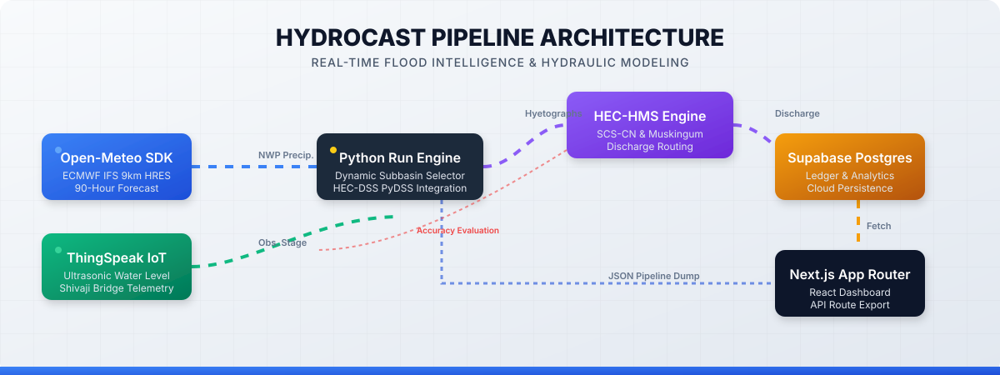

# HydroCast Technical Documentation Library

  

Welcome to the comprehensive technical documentation for **HydroCast: Real-Time Operational Flood Forecasting & Basin Intelligence** for the Panchganga River Catchment (Kolhapur District, Maharashtra, India).

## Technical Modules

| Module | Document | Description |
| :--- | :--- | :--- |
| **System Architecture** | [`Architecture.md`](./Architecture.md) | 12-Step operational prediction pipeline, fault tolerance, and self-healing mechanics. |
| **API & Backend** | [`Backend.md`](./Backend.md) | FastAPI REST services, asyncpg connection pooling, WebSocket broadcasting, and endpoints. |
| **Frontend Dashboard** | [`Frontend.md`](./Frontend.md) | Next.js 14 App Router, Tailwind CSS design system, Chart.js, and Leaflet GIS mapping. |
| **Database Architecture** | [`Database.md`](./Database.md) | PostgreSQL production schema, Supabase cloud sync, views, and JSON multi-run ledger. |
| **Open-Meteo & ECMWF** | [`Openmeteo.md`](./Openmeteo.md) | ECMWF IFS 0.25° quantitative precipitation forecasting pipeline and API integration. |
| **Rain Gauge Network** | [`Raingauge_Station.md`](./Raingauge_Station.md) | 18 primary and alternate stations, geographical topology, and dynamic selection. |
| **Basin Hydrology** | [`Hydrology.md`](./Hydrology.md) | 2,140 km² Panchganga basin physiography, subbasins S1–S9, and SCS Curve Number model. |
| **Runoff Computation** | [`Runoff_Computation.md`](./Runoff_Computation.md) | Mathematical runoff continuum, loss rate, unit hydrograph convolution, and routing. |
| **HEC-HMS Automation** | [`HMS.md`](./HMS.md) | Headless USACE HEC-HMS 4.x batch runner, DSS time series, and Python SCS-CN emulator. |
| **River Hydraulics** | [`Hydraulics.md`](./Hydraulics.md) | Manning open-channel flow, bed slope calibration ($S_0 = 0.005858$), and compound cross-sections. |
| **Rating Curves** | [`Stage_Conversion_Discharge.md`](./Stage_Conversion_Discharge.md) | Bi-directional monotonic PCHIP rating curves ($dQ/dh > 0$) for Shivaji Bridge & Rajaram Weir. |
| **Model Calibration** | [`Calibration_Validation.md`](./Calibration_Validation.md) | Spearman rank $\rho$, Nash-Sutcliffe Efficiency (NSE), PBIAS, RMSE, and WRD benchmarks. |
| **Rainfall Validation** | [`Rainfall_Validation_Pipeline.md`](./Rainfall_Validation_Pipeline.md) | Observed rainfall ingestion, ground truth telemetry verification, and QC checks. |
| **WRD Ground Truth** | [`WRD_Historical_Rating_Curve_CrossCheck.md`](./WRD_Historical_Rating_Curve_CrossCheck.md) | Historical flood marks cross-verification vs Maharashtra WRD government records. |
| **IoT Telemetry** | [`IoT_Telemetry.md`](./IoT_Telemetry.md) | ThingSpeak ultrasonic radar level sensor, 549.35m datum, and live stage polling. |
| **GIS Vector Layers** | [`Shpfiles.md`](./Shpfiles.md) | GeoJSON subbasin delineations, stream network routing, and DEM processing. |
| **Engineering Autopsy** | [`Errors_Mistakes_Engineering_Assumptions.md`](./Errors_Mistakes_Engineering_Assumptions.md) | Historical post-mortem of bed slope distortion, wetted perimeter collapse, and bugs. |
| **System Novelty** | [`Novelty_of_this_System.md`](./Novelty_of_this_System.md) | 10 core scientific and architectural innovations of HydroCast vs traditional warning systems. |
| **PI Research Report** | [`Accuracy_Analysis_PI_Report.md`](./Accuracy_Analysis_PI_Report.md) | Formal research report prepared for the Principal Investigator on model accuracy. |
| **Production Roadmap** | [`ROADMAP.md`](./ROADMAP.md) | 5 Open-source production hardening pillars: Dockerization, alerting, archival, and security. |
| **Operations Manual** | [`Deployment_Operations.md`](./Deployment_Operations.md) | Linux systemd, PM2 process management, automated 6-hourly cron jobs, and NGINX setup. |
