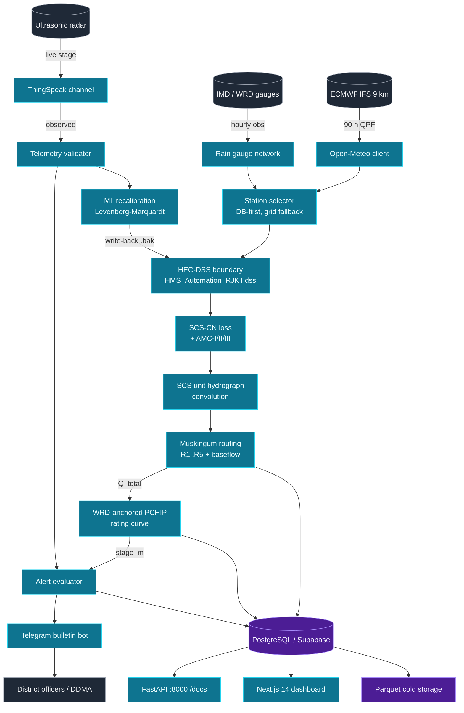
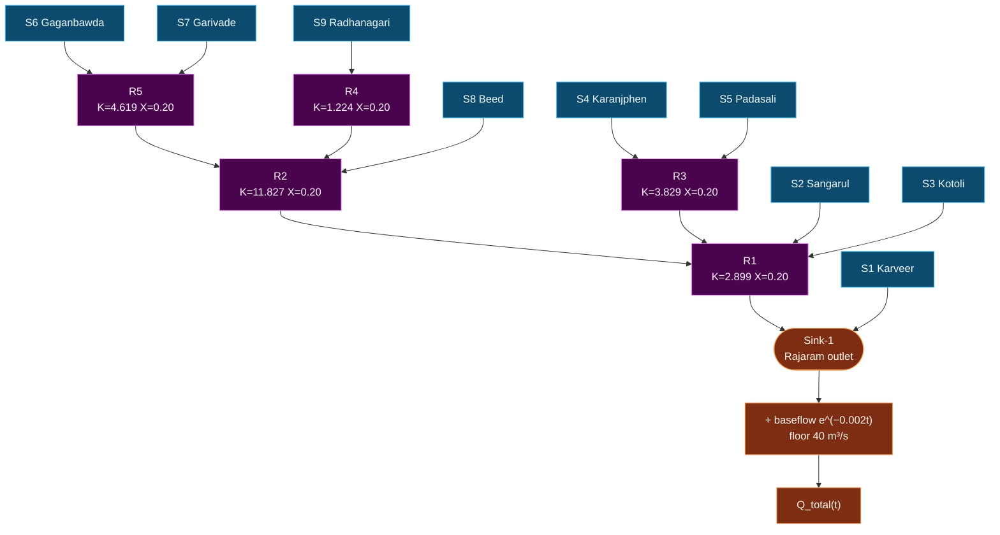
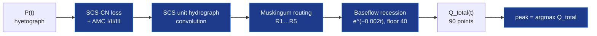
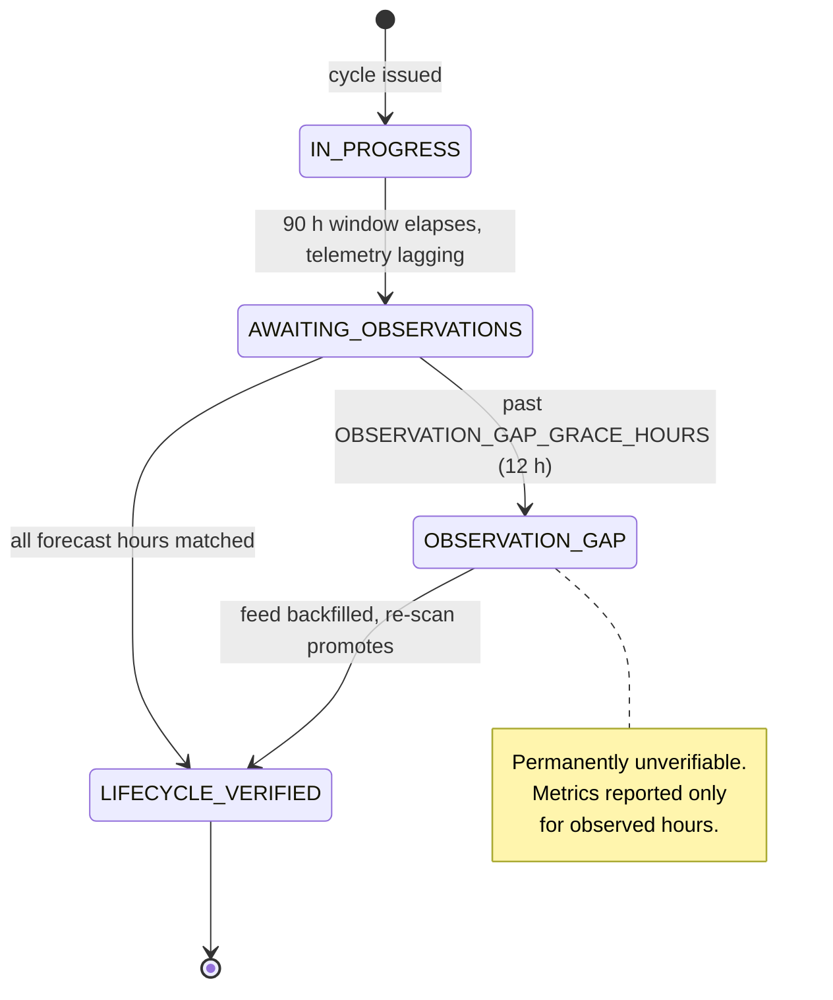

# Architecture Atlas

Every figure in the HydroCast documentation, collected in one place. Each
diagram appears twice: once as **ASCII box-art** (always renders, copy-pasteable,
works offline and in a terminal) and once as a **Mermaid flowchart** (renders as
an interactive diagram in the browser).

!!! tip "Reading the figures"
    - **Solid box** = a process or service.
    - **Double bracket** `[ ]` = a data store.
    - **Circle** `( )` = an external system.
    - `──►` = data flow direction, labelled with what actually flows.

---

## 1. Master system map

```text
╔══════════════════════════════════════════════════════════════════════════════════╗
║                     HYDROCAST — REAL-TIME FLOOD FORECASTING                       ║
║          Panchganga Basin · Kolhapur, Maharashtra · DST-SERB funded                 ║
╚══════════════════════════════════════════════════════════════════════════════════╝

   (ECMWF IFS 9 km)          (IMD / WRD gauges)         (Ultrasonic radar)
          │                        │                          │
          │ 90 h QPF               │ hourly obs               │ live stage
          ▼                        ▼                          ▼
   ┌──────────────┐        ┌──────────────┐         ┌──────────────┐
   │  Open-Meteo  │        │  Rain gauge  │         │  ThingSpeak  │
   │   forecast   │        │   network    │         │  channel      │
   │  18 stations │        │  18 stations │         │  3424513      │
   └──────┬───────┘        └──────┬───────┘         └──────┬───────┘
          │                       │                          │
          └───────────┬───────────┘                          │
                      ▼                                      │
            ┌───────────────────┐                            │
            │ Station selector  │  DB-first, grid fallback   │
            │  S1..S9 → gauge   │                            │
            └─────────┬─────────┘                            │
                      │                                      │
                      ▼                                      │
            ┌───────────────────┐                            │
            │ HEC-DSS boundary  │  //<GAGE>/PRECIP-INC/...   │
            │  HMS_Automation   │                            │
            │      RJKT.dss     │                            │
            └─────────┬─────────┘                            │
                      │                                      │
                      ▼                                      │
   ┌──────────────────────────────────────────┐              │
   │        HYDROLOGIC ENGINE  (HEC-HMS)      │              │
   │  ┌────────┐  ┌────────┐  ┌───────────┐  │              │
   │  │SCS-CN  │─►│SCS-UH  │─►│Muskingum  │  │              │
   │  │  loss  │  │convolve│  │  routing  │  │              │
   │  └────────┘  └────────┘  └───────────┘  │              │
   │            + AMC-I / II / III            │              │
   │            + baseflow recession           │              │
   └────────────────────┬─────────────────────┘              │
                        │ Q_total (90 pts)                    │
                        ▼                                    │
   ┌──────────────────────────────────────────┐              │
   │   HYDRAULIC RATING  (WRD-anchored PCHIP) │              │
   │   Q → stage at Shivaji & Rajaram         │              │
   └────────────────────┬─────────────────────┘              │
                        │ stage_m                            │
                        ▼                                    │
              ┌───────────────────┐                           │
              │  Alert evaluator  │◄──────────────────────────┘
              │  watch/warning/   │   ▲ discrepancy |Δt| ≥ 1 h
              │  emergency        │   │           Δh > 0.25 m
              └─────────┬─────────┘   │
                        │             │
                        ▼             │
              ┌───────────────────┐   │        ┌────────────────────────┐
              │  Telegram flood   │   └────────│  ML recalibration     │
              │  bulletin bot     │            │  Levenberg–Marquardt   │
              └───────────────────┘            │  → Basin_1.basin (.bak)│
                        │                     └────────────────────────┘
                        ▼
              ┌───────────────────┐
              │ District officers │
              │  DDMA control room│
              └───────────────────┘

                        │
                        ▼  every cycle
        ┌───────────────────────────────────────────┐
        │  [PostgreSQL 15 / Supabase]               │
        │     simulation_runs · subbasin_rainfall_ts│
        │     bridge_stage_forecast · alert_events   │
        │     pipeline_step_log · station_selection │
        └────────────────────┬──────────────────────┘
                             │
              ┌──────────────┼──────────────┐
              ▼              ▼              ▼
     ┌────────────┐  ┌─────────────┐  ┌──────────────┐
     │ FastAPI    │  │ Next.js 14  │  │ Parquet cold │
     │ :8000      │  │ dashboard   │  │ storage      │
     │ /docs      │  │ (Vercel)    │  │ (> 90 days)  │
     └────────────┘  └─────────────┘  └──────────────┘
```



---

## 2. The 12-step forecast pipeline

```text
 ┌────────────────────────────────────────────────────────────────────────────────┐
 │  CRON: 30 02:00 / 08:00 / 14:00 / 20:00 UTC   (00z, 06z, 12z, 18z cycles)     │
 └──────────────────────────────────┬─────────────────────────────────────────────┘
                                    ▼
 ╔═══════════════════════════════════════════════════════════════════════════════╗
 ║  STEP  NAME                       SOURCE MODULE              TIME           ║
 ╠═══════════════════════════════════════════════════════════════════════════════╣
 ║  01   Download ECMWF IFS QPF       src/ecmwf/downloader       ~ 8 s         ║
 ║  02   Select governing gauges      src/ecmwf/station_selector ~ 2 s         ║
 ║  02b  Soil-moisture snapshot       src/ecmwf/open_meteo       ~ 4 s         ║
 ║       (observability only — never feeds CN, K, x or routing)                  ║
 ║  03   Live telemetry fetch         src/sensors/thingspeak_gauge ~ 2 s        ║
 ║  04   Real-time ML recalibration   src/hydrology/ml_calibration ~ 6 s        ║
 ║  05   HEC-HMS / emulator run       src/hms/runner             ~15 ms*       ║
 ║  06   Stage conversion             src/hydrology/stage_converter ~ 1 s       ║
 ║  07   Peak detection & CI          src/hms/runner             < 1 s         ║
 ║  08   Accuracy evaluation          src/hydrology/validation_metrics ~ 2 s   ║
 ║  09   DSS write + run archive      src/dss/writer, runs_tracker  ~ 1 s       ║
 ║  10   Database persistence         src/orchestrator            ~ 1 s        ║
 ║  11   Alert evaluation & dispatch  src/alerts/                 ~ 1 s         ║
 ║  12   Dashboard broadcast          ws_manager.broadcast()      < 1 s         ║
 ╚═══════════════════════════════════════════════════════════════════════════════╝
     * 15 ms with the pure-Python emulator; up to 300 s with a native HEC-HMS batch run.
```


---

## 3. Hydrologic network topology

The routing order below is read directly from `Basin_1.basin`; it is not
hard-coded in the emulator.

```text
      S6 Gaganbawda  (227.72 km², CN 61.78)        S7 Garivade  (195.39 km², CN 61.28)
              \                                                    /
               \                                                  /
                v                                                v
          ┌───────────────────────────────────────────────────┐
          │   Reach R5   Upper Kumbhi River                      │
          │   K = 4.619 hr     X = 0.200                         │
          └───────────────────────┬─────────────────────────────┘
                                  │
      S9 Radhanagari (366.97 km²) │  (R5 outflow)      S8 Beed (177.44 km², CN 65.76)
              │                    │                             │
              v                    │                             │
      ┌──────────────────┐         │                             │
      │  Reach R4        │         │                             │
      │  Bhogavati Trunk │         │                             │
      │  K = 1.224 hr     │         │                             │
      │  X = 0.200       │         │                             │
      └────────┬─────────┘         │                             │
               │ (R4 outflow)      │                             │
               \                   │                             │
                v                  v                             v
          ┌───────────────────────────────────────────────────┐
          │   Reach R2   Middle Panchganga                      │
          │   K = 11.827 hr    X = 0.200                        │
          └───────────────────────┬─────────────────────────────┘
                                  │  (R2 outflow)
      S4 Karanjphen (262.00 km²)  │  S5 Padasali (106.39 km²)
              \                  │        /
               \                 │       /
                v                v      v
          ┌───────────────────────────────────────────────────┐
          │   Reach R3   Kasari River Main                     │
          │   K = 3.829 hr     X = 0.200                        │
          └───────────────────────┬─────────────────────────────┘
                                  │  (R3 outflow)
      S2 Sangarul (153.77 km²)    │    S3 Kotoli (261.32 km²)
              \                  │          /
               v                 v         v
          ┌───────────────────────────────────────────────────┐
          │   Reach R1   Lower Panchganga Trunk                 │
          │   K = 2.899 hr     X = 0.200                        │◄──── S2, S3 direct
          └───────────────────────┬─────────────────────────────┘
                                  │  (R1 outflow)
                                  v
          ┌───────────────────────────────────────────────────┐
          │   Sink-1   Panchganga Basin Outlet (Rajaram)        │
          │                                                     │
          │   + S1 Karveer direct  (86.213 km², CN 74.85)       │
          │   + Exponential baseflow  Q_bf(t) = Q₀·e^(−0.002t)   │
          │   + WRD monsoon floor  Q_bf ≥ 40.0 m³/s             │
          │   = Q_total(t)  [ T+0 … T+89 h ]                    │
          └───────────────────────────────────────────────────┘
```



---

## 4. Loss → transform → routing continuum

```text
   hyetograph P(t) [mm/hr]
          │
          ▼
   ┌─────────────────────────────────────────────────────────────────┐
   │ ① SCS CURVE NUMBER LOSS                          per subbasin  │
   │                                                                 │
   │    AMC class from mean 90 h catchment rainfall P̄:              │
   │      P̄ < 25 mm   → AMC-I    (TR-55 dry soil)                   │
   │      25 ≤ P̄ < 65 → AMC-II   (as designed)                      │
   │      P̄ ≥ 65 mm   → AMC-III  (TR-55 saturated soil)             │
   │                                                                 │
   │    S   = 25400/CN − 254                        [mm]            │
   │    Ia  = λ · S,   λ = 0.20 / 0.15 / 0.08                       │
   │    Qc  = (Pc − Ia)² / (Pc − Ia + S) + 0.02 · Pc    if Pc > Ia  │
   │    ΔPex = max(0, Qc(h) − Qc(h−1))                 [mm/hr]      │
   └───────────────────────────┬─────────────────────────────────────┘
                               ▼
   ┌─────────────────────────────────────────────────────────────────┐
   │ ② SCS DIMENSIONLESS UNIT HYDROGRAPH              per subbasin  │
   │                                                                 │
   │    tp  = 0.5 + lag_min/60                        [h]           │
   │    u(t)= (t/tp)^3.7 · exp[ 3.7 (1 − t/tp) ]                    │
   │    UH  = u(t) · (A_sub · 1000) / ( Σ u(t) · 3600 )             │
   │            ▲ normalises to exactly 1 mm of depth over A_sub     │
   │    Qdir = ΔPexcess  (∗)  UH                    [m³/s]          │
   └───────────────────────────┬─────────────────────────────────────┘
                               ▼
   ┌─────────────────────────────────────────────────────────────────┐
   │ ③ MUSKINGUM REACH ROUTING                    5 reaches, in order│
   │                                                                 │
   │    S = K · [ X·I + (1−X)·O ]                                    │
   │    O₂ = C₀·I₂ + C₁·I₁ + C₂·O₁                                    │
   │                                                                 │
   │    Sub-step so that BOTH hold:                                  │
   │        Δt / [2(1−X)]  ≤  K' = K/n  ≤  Δt / (2X)                 │
   │    ⇒  C₀, C₁, C₂ ≥ 0  and  ΣO ≡ ΣI   (mass conserved)          │
   │                                                                 │
   │    Removes HEC-HMS WARNING 41169 (negative coefficients)        │
   └───────────────────────────┬─────────────────────────────────────┘
                               ▼
   ┌─────────────────────────────────────────────────────────────────┐
   │ ④ BASEFLOW RECESSION                       at Sink-1           │
   │                                                                 │
   │    Q_bf(t) = Q_bf(0) · exp( −0.002 · t )                        │
   │    Q_bf(0) ≥ 40.0 m³/s   (WRD-grounded monsoon floor)          │
   │                                                                 │
   │    Q_total(t) = Q_surface(t) + Q_bf(t)                          │
   │                                                                 │
   │    peak  = argmax Q_total(t)          ← never overridden       │
   │    event = (Q_peak − Q_bf) > max(1, 0.10·Q_bf(0))   (a label)  │
   └─────────────────────────────────────────────────────────────────┘
```



---

## 5. Rating curve: discharge → stage

```text
   Q_total (m³/s)
        │
        ▼
   ┌──────────────────────────────────────────────────────────────────────┐
   │  PCHIP interpolation on WRD-anchored control points                  │
   │  (monotonic, shape-preserving ⇒ dQ/dh > 0, no overshoot)            │
   ├──────────────────────────────────────────────────────────────────────┤
   │                                                                      │
   │  RAJARAM (WRD sheet, direct)                                         │
   │    stage  529.318 ─ 530.18 ─ 532.70 ─ 533.36 ─ … ─ 543.30 ─ 545.33  │
   │    Q m³/s   0.0      0.0     14.16    71.25  ─ … ─ 2675.0  3850.0   │
   │                                                                      │
   │  SHIVAJI = same Q, stage − 0.648 m (downstream bed datum)            │
   │    stage  528.670 ─ 532.052 ─ 532.712 ─ … ─ 544.682                 │
   │    Q m³/s   0.0      14.16     71.25    ─ … ─  2675.0               │
   │                                                                      │
   │  Cross-check: WRD recorded the Shivaji ALERT stage 542.10 m at the   │
   │  same 1800 m³/s as the Rajaram WARNING — exactly the 0.648 m shift.  │
   └───────────────────────────────┬──────────────────────────────────────┘
                                   │  invert (monotonic ⇒ single-valued)
                                   ▼
   stage_m (m MSL)  at Chhatrapati Shivaji Maharaj Bridge
                                   │
                                   ▼
   ┌──────────────────────────────────────────────────────────────────────┐
   │  ALERT CLASSIFICATION                                               │
   │     stage ≥ 545.33  →  HFL_EXCEEDED   (3 850 m³/s historical peak)   │
   │     stage ≥ 543.30  →  DANGER         (2 675 m³/s danger mark)       │
   │     stage ≥ 542.70  →  WARNING        (1 800 m³/s warning mark)      │
   │     stage ≥ 542.10  →  ALERT          (WRD alert mark)               │
   │     otherwise       →  NORMAL                                         │
   └──────────────────────────────────────────────────────────────────────┘
```

---

## 6. Closed-loop telemetry validation

```text
   ┌──────────────────────────┐
   │ ThingSpeak hourly cache  │◄──── 1. fetch feeds (1 h resample)
   └────────────┬─────────────┘
                │
   ┌──────────────────────────┐
   │ stored run forecast      │◄──── 2. load_run_forecast(cycle_id)
   │ bridgeShivaji.forecast   │      (predicted stage per lead hour)
   └────────────┬─────────────┘
                │
                ▼
   ┌──────────────────────────────────────────────────────────────────┐
   │ 3. match hours  →  (predicted_stage, observed_stage) pairs       │
   └────────────┬─────────────────────────────────────────────────────┘
                │
      ┌─────────┴──────────┐
      │                    │
      ▼                    ▼
  n = 0               n ≥ 1
      │                    │
      ▼                    ▼
 INSUFFICIENT_     ┌──────────────────────────────┐
 DATA              │ 4. compute_pure_metrics()     │
                    │                              │
 grade =            │  ERROR metrics → always      │
 ACCUMULATING_      │    RMSE, MAE, PBIAS          │
 TELEMETRY          │                              │
                    │  SKILL metrics → only if     │
                    │    n ≥ 6                     │
                    │    σ(obs) ≥ 0.05 m           │
                    │    Σ(O−Ō)² > 1e-4            │
                    │    ⇒ NSE, ρ, r²              │
                    └───────────┬──────────────────┘
                                │
                                ▼
                    ┌──────────────────────────────┐
                    │ 5. lifecycle state machine    │
                    └───────────┬──────────────────┘
                                │
        ┌───────────────────────┼───────────────────────┐
        ▼                       ▼                       ▼
   verified_hours         window elapsed         elapsed AND
     == total_hours        (wall clock)          past grace AND
        │                       │                still missing
        ▼                       ▼                       ▼
 LIFECYCLE_              AWAITING_                OBSERVATION_
 VERIFIED                OBSERVATIONS             GAP
                                │
                         verified_hours > 0
                                ▼
                          IN_PROGRESS
```



!!! note "Why a gap is not the same as a failure"
    A run whose window has elapsed but whose telemetry is still arriving stays
    `AWAITING_OBSERVATIONS` — re-validatable, because more hours may land. Only
    after `OBSERVATION_GAP_GRACE_HOURS` (default 12 h) of continued absence is
    it stamped `OBSERVATION_GAP`. And even those are re-scanned, so a sensor
    feed that is backfilled a week later still promotes the run to
    `LIFECYCLE_VERIFIED`. The state is an explanation, not a verdict.

---

## 7. Data lineage & provenance

```text
   ┌──────────────────────┐        ┌──────────────────────┐
   │ STORED  (persisted)  │        │ DERIVED  (computed)  │
   ├──────────────────────┤        ├──────────────────────┤
   │ Curve Number (CN)    │ ──────►│  CN transform per AMC│
   │ Muskingum K, x       │ ──────►│  routing coefficients │
   │ Subbasin lag         │ ──────►│  unit hydrograph tp   │
   │ WRD stage–Q anchors  │ ──────►│  PCHIP rating curve   │
   │ Surveyed X-sections  │ ──────►│  wetted area A, P, R  │
   │ Observed gauge rain  │ ──────►│  volume error metrics │
   │ Observed sensor stage│ ──────►│  stage error metrics  │
   └──────────────────────┘        └──────────┬───────────┘
                                             │
                        ┌────────────────────┴────────────────────┐
                        │                                         │
                        ▼                                         ▼
              ┌───────────────────┐                    ┌──────────────────────┐
              │ MEASURED          │                    │ DERIVED              │
              │ rainfall mm       │                    │ discharge m³/s       │
              │ water level m     │                    │ volume m³            │
              │ timestamps        │                    │ NSE, ρ, r²           │
              └───────────────────┘                    └──────────────────────┘

   The distinction matters: "observed discharge" in HydroCast is the observed
   STAGE pushed through the same rating curve that produced the forecast. It is
   labelled RATING_IMPLIED_DERIVED everywhere it appears, because it is a
   monotone transform of the stage error, not independent evidence of discharge
   skill.
```

---

## 8. Deployment topology

```text
                          ┌──────────────────────────────┐
                          │      GitHub (main)           │
                          │  pipeline.yml · tests.yml    │
                          │  telemetry_validation.yml    │
                          └───────┬──────────────┬───────┘
                                  │              │
                    cron 4×/day   │              │  push / PR
                                  ▼              ▼
                      ┌──────────────────────────────────────┐
                      │   Ubuntu GitHub Runner (ephemeral)   │
                      │                                      │
                      │  1. Open-Meteo ECMWF IFS fetch      │
                      │  2. Station selection                │
                      │  3. HEC-DSS boundary write           │
                      │  4. HEC-HMS / pure-Python emulator   │
                      │  5. Rating curve + alerts            │
                      │  6. PostgreSQL (Supabase) write      │
                      │  7. Telegram bulletin dispatch       │
                      │  8. data/runs/*.json  ◄── committed  │
                      └──────────────────┬───────────────────┘
                                         │
                        ┌────────────────┼────────────────┐
                        ▼                ▼                ▼
               ┌─────────────┐  ┌──────────────┐  ┌──────────────┐
               │  Supabase   │  │  gh-pages    │  │  Vercel      │
               │  PostgreSQL │  │  MkDocs site │  │  Next.js 14  │
               │  + PostGIS  │  │  (this page) │  │  dashboard   │
               └─────────────┘  └──────────────┘  └──────────────┘

   ┌────────────────────────────────────────────────────────────────────┐
   │  Local development                                                  │
   │                                                                    │
   │   Docker Compose:  backend (FastAPI :8000)  ·  frontend (:3000)    │
   │                    postgres (5432)          ·  telegram-bot        │
   │                                                                    │
   │   HEC-HMS 4.13 does not run on Linux — the calibrated pure-Python    │
   │   emulator in src/hms/runner.py is the production path.              │
   └────────────────────────────────────────────────────────────────────┘
```

---

## 9. Symbol legend

| Symbol | Meaning |
|:---:|:---|
| `┌ ─ ┐ │ └ ┘` | Process or service boundary |
| `╔ ═ ╗ ║ ╚ ╝` | Emphasised boundary (whole-system frames) |
| `[ ... ]` | Data store (database, file, cache) |
| `( ... )` | External system outside our control |
| `──►` | Data flow, annotated with what flows |
| `····►` | Control flow or trigger |
| `◄──` | Feedback / return path |
| `λ` | Antecedent moisture initial-abstraction ratio (0.20 / 0.15 / 0.08) |
| `P̄` | Catchment-mean 90-hour rainfall (the AMC classifier input) |
| `Q_bf` | Baseflow component of total discharge |
| `σ(obs)` | Standard deviation of the observed series (skill-metric gate) |
