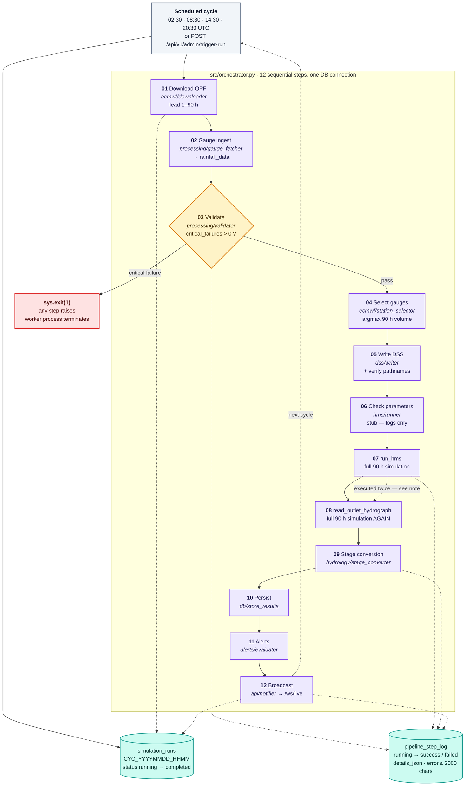
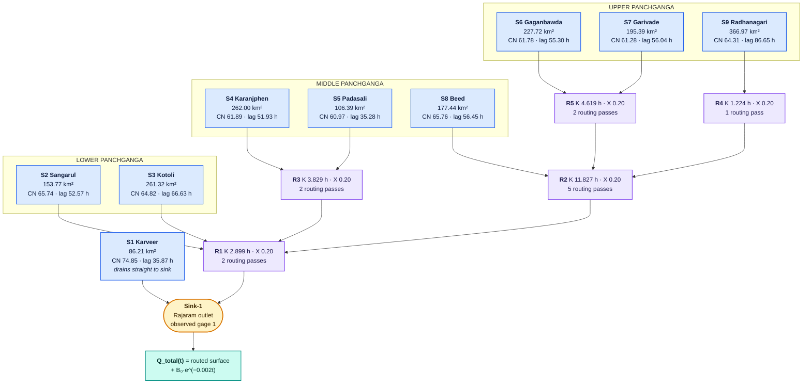
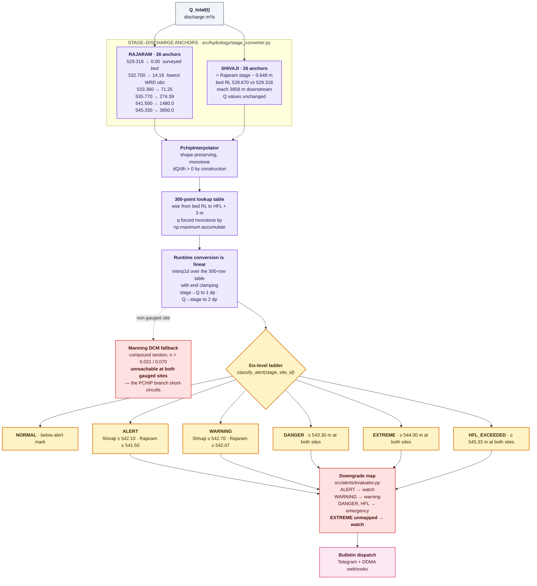
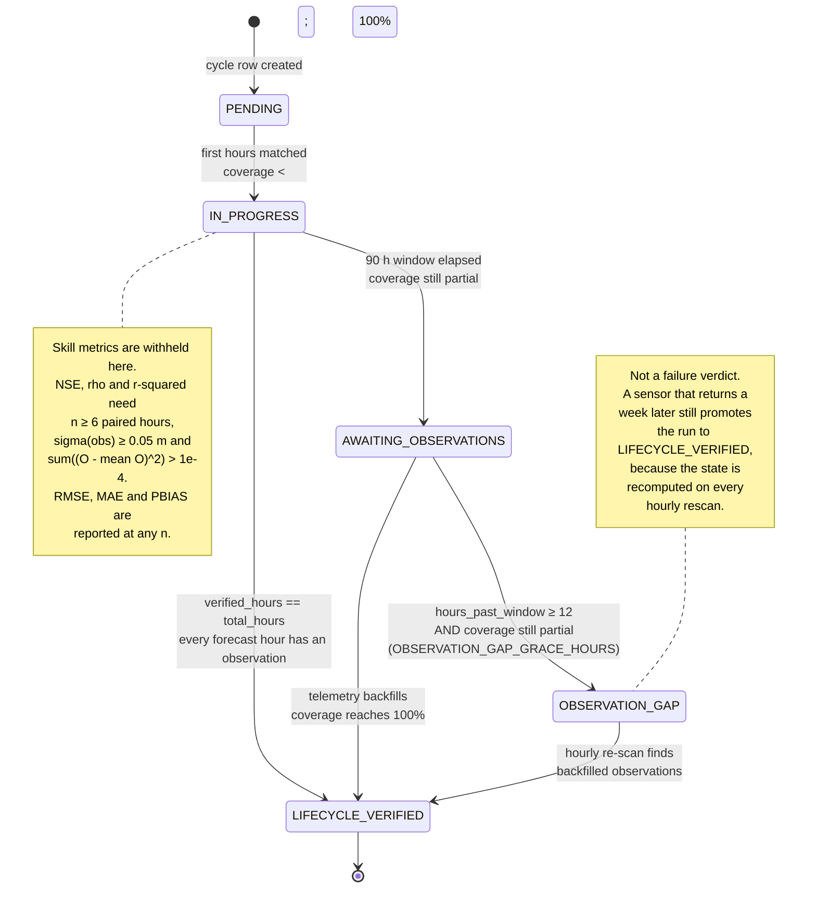
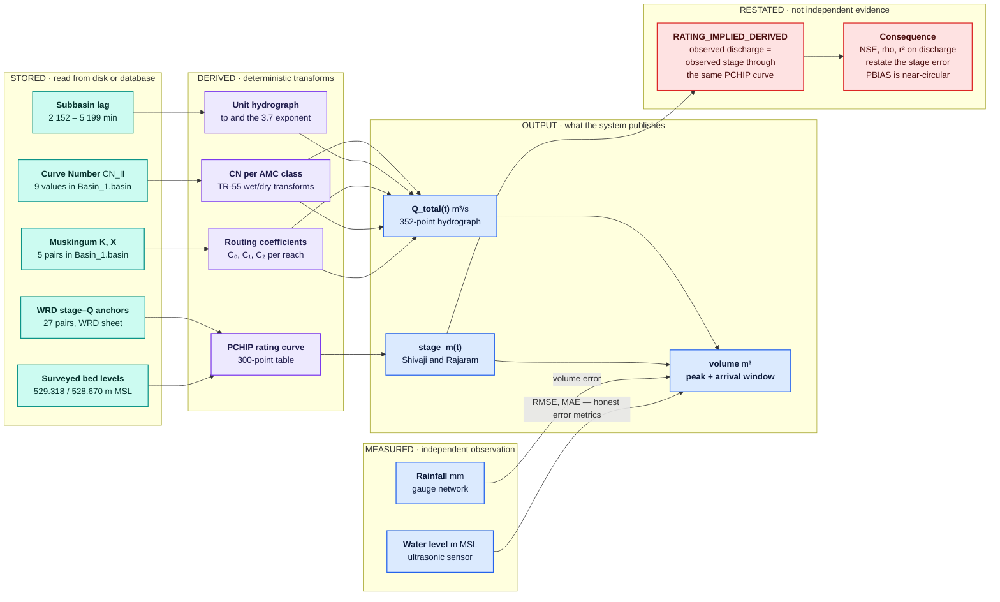
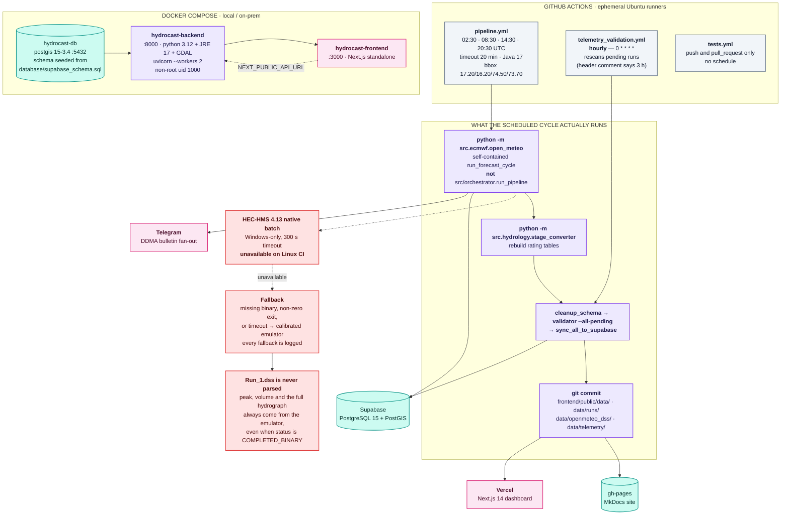

# Architecture Atlas

This page is the engineering reference for how HydroCast actually moves water
from a numerical weather prediction grid to a warning message in a district
control room. It is organised as a walk down the pipeline: forcing, ingestion,
selection, the runoff computation, the stage conversion, the closed telemetry
loop, persistence, and deployment.

Every figure appears twice. The **ASCII box-art** is the compact overview — it
always renders, copies cleanly into a terminal, and works on a field tablet
with no network. The **Mermaid diagram** underneath it is the detailed view: it
carries the governing equation, the parameter value, the threshold, the module
that implements it, and the branch that is taken when something fails. If you
only read one of the two, read the Mermaid — it is the one with the engineering
in it.

!!! warning "The diagrams describe the code, not the intent"
    Several figures here contradict what the surrounding prose originally
    claimed, because the code turned out to differ from the design. Where that
    happens the diagram shows the **code**, and the prose says so explicitly.
    The most consequential instance is that HEC-HMS results are never parsed:
    the numbers in every forecast come from the pure-Python emulator, even when
    the HEC-HMS binary reports success. See
    [Errors & Engineering Assumptions](errors-and-engineering-assumptions.md)
    for the full register.

!!! tip "Reading the figures"
    Node fill colour encodes the *kind* of thing, consistently across every
    diagram on this page.

    | Fill | Meaning |
    |:---|:---|
    | Slate | External forcing we do not control |
    | Blue | Ingestion and quality control |
    | Amber | A decision point with a real branch |
    | Violet | Hydrologic or hydraulic computation |
    | Teal | Persistence |
    | Pink | Delivery to a human |
    | Red | Fallback, fault, or degraded path |
    | Indigo | The closed calibration loop |

    Every edge is labelled with the quantity that flows and its unit. A dashed
    edge is a control or trigger relationship, not a data flow.

---

## 1. Master system map

The system is a chain of transformations with exactly one feedback path. Water
enters as a rainfall forecast over the Panchganga catchment, is routed through
a calibrated nine-subbasin model, is converted to a water level against the
Maharashtra WRD rating sheet, and is compared against a live ultrasonic sensor.
If that comparison shows the model arrived at the wrong time or the wrong
height, the model parameters are re-fitted and written back to disk. That
feedback edge — from observed stage back to the basin file — is the defining
feature of the design and the reason it is drawn as a distinct colour
everywhere.

```text
   (ECMWF IFS 9 km)          (IMD / WRD gauges)         (Ultrasonic radar)
          │                        │                          │
          │ 90 h QPF               │ hourly obs               │ live stage
          ▼                        ▼                          ▼
   ┌──────────────┐        ┌──────────────┐         ┌──────────────┐
   │  Open-Meteo  │        │  Rain gauge  │         │  ThingSpeak  │
   │   forecast   │        │   network    │         │  channel     │
   │  20 stations │        │  20 stations │         │  3424513     │
   └──────┬───────┘        └──────┬───────┘         └──────┬───────┘
          │                       │                          │
          └───────────┬───────────┘                          │
                      ▼                                      │
            ┌───────────────────┐                            │
            │ QC gate           │  ≤500 mm/h · ≥50% cover    │
            │ physical bounds   │  lag ≤60 min · NWP ≤8 h    │
            └─────────┬─────────┘                            │
                      │                                      │
                      ▼                                      │
            ┌───────────────────┐                            │
            │ Station selector  │  max 90 h volume           │
            │  S1..S9 → gauge   │                            │
            └─────────┬─────────┘                            │
                      │                                      │
                      ▼                                      │
            ┌───────────────────┐                            │
            │ HEC-DSS boundary  │  //<GAGE>/PRECIP-INC/...   │
            │  HMS_Automation   │                            │
            │      RJKT.dss     │                            │
            └─────────┬─────────┘                            │
                      │                                      │
                      ▼                                      │
   ┌──────────────────────────────────────────┐              │
   │        HYDROLOGIC ENGINE  (emulator)     │              │
   │  ┌────────┐  ┌────────┐  ┌───────────┐  │               │
   │  │SCS-CN  │─►│SCS-UH  │─►│Muskingum  │  │               │
   │  │  loss  │  │convolve│  │  routing  │  │               │
   │  └────────┘  └────────┘  └───────────┘  │               │
   │            + AMC-I / II / III            │              │
   │            + baseflow recession           │             │
   └────────────────────┬─────────────────────┘              │
                        │ Q_total (352 pts)                  │
                        ▼                                    │
   ┌──────────────────────────────────────────┐              │
   │   HYDRAULIC RATING  (WRD-anchored PCHIP) │              │
   │   Q → stage at Shivaji & Rajaram         │              │
   └────────────────────┬─────────────────────┘              │
                        │ stage_m                            │
                        ▼                                    │
              ┌───────────────────┐                          │
              │  Alert evaluator  │◄─────────────────────────┘
              │  6-level ladder   │   ▲ discrepancy |Δt| ≥ 1 h
              │  NORMAL…HFL_EXC.  │   │           Δh > 0.25 m
              └─────────┬─────────┘   │
                        │             │
                        ▼             │
              ┌───────────────────┐   │        ┌────────────────────────┐
              │  Telegram flood   │   └────────│  ML recalibration      │
              │  bulletin bot     │            │  Levenberg–Marquardt   │
              └───────────────────┘            │  → Basin_1.basin (.bak)│
                        │                     └────────────────────────┘
                        ▼
              ┌───────────────────┐
              │ District officers │
              │  DDMA control room│
              └───────────────────┘

                        │
                        ▼  every cycle
        ┌───────────────────────────────────────────┐
        │  [PostgreSQL 15 / Supabase]               │
        │     simulation_runs · subbasin_rainfall_ts│
        │     bridge_stage_forecast · pipeline_step_log│
        └────────────────────┬──────────────────────┘
                             │
              ┌──────────────┼──────────────┐
              ▼              ▼              ▼
     ┌────────────┐  ┌─────────────┐  ┌──────────────┐
     │ FastAPI    │  │ Next.js 14  │  │ Parquet cold │
     │ :8000      │  │ dashboard   │  │ storage      │
     │ /docs      │  │ (Vercel)    │  │ (> 90 days)  │
     └────────────┘  └─────────────┘  └──────────────┘
```



```mermaid
flowchart TB

    subgraph S0["FORCING · outside system control"]
        direction LR
        NWP["<b>ECMWF IFS HRES 9 km</b><br/>Open-Meteo REST<br/>lead 1–90 h · 1 h step"]
        RG["<b>Rain-gauge network</b><br/>20 stations in registry<br/>hourly observed depth"]
        LS["<b>Ultrasonic level sensor</b><br/>Shivaji Bridge deck<br/>datum 549.35 m MSL"]
    end

    subgraph S1["1 · INGESTION &amp; QUALITY CONTROL"]
        direction TB
        FC["<b>Forecast client</b><br/><i>src/ecmwf/open_meteo.py</i><br/>5 retries · backoff 0.2<br/>3600 s response cache"]
        GF["<b>Gauge ingest</b><br/><i>src/processing/gauge_fetcher.py</i><br/>hourly obs → rainfall_data"]
        QC{"<b>Quality gate</b><br/><i>src/processing/validator.py</i><br/>depth ≤ 500 mm/h<br/>coverage ≥ 50% of 90 h<br/>gauge lag ≤ 60 min<br/>NWP age ≤ 8 h"}
        ABORT["<b>critical_failures &gt; 0</b><br/>ValueError raised<br/>pipeline aborts"]
    end

    subgraph S2["2 · SPATIAL SELECTION &amp; BOUNDARY"]
        direction TB
        SEL["<b>Governing-gauge router</b><br/><i>src/ecmwf/station_selector.py</i><br/>per subbasin: argmax of<br/>90 h cumulative volume"]
        SELFB["<b>fallback scoring</b><br/>rainfall ÷ (distance + 1)<br/>when DB row is absent"]
        DSS["<b>HEC-DSS boundary write</b><br/><i>src/dss/writer.py</i><br/>//GAGE/PRECIP-INC/DDMMMYYYY/1HOUR/GAGE/"]
    end

    subgraph S3["3 · HYDROLOGIC COMPUTATION"]
        direction TB
        PARSE["<b>Basin parser</b><br/><i>src/hms/basin_parser.py</i><br/>reads 9 subbasins + 5 reaches<br/>from Basin_1.basin at runtime"]
        LOSS["<b>SCS-CN loss</b> S = 25400/CN − 254<br/>Ia = λS, λ = 0.20/0.15/0.08"]
        UH["<b>SCS unit hydrograph</b><br/>u(t) = (t/tp)^3.7 · e^(3.7(1−t/tp))<br/>tp = 0.5 + lag/60"]
        MUSK["<b>Muskingum routing</b><br/>R5→R4→R2→R3→R1<br/>C₀+C₁+C₂ = 1 exactly"]
        BF["<b>Baseflow recession</b><br/>Q_bf = B₀·e^(−0.002t)<br/>B₀ from live sensor<br/>91.1 only when telemetry absent"]
    end

    subgraph S4["4 · STAGE CONVERSION &amp; ALERTING"]
        direction TB
        RATE["<b>WRD-anchored PCHIP rating</b><br/><i>src/hydrology/stage_converter.py</i><br/>27 Rajaram anchors<br/>Shivaji = Rajaram − 0.648 m"]
        TIER{"<b>Six-level ladder</b><br/>NORMAL · ALERT · WARNING<br/>DANGER · EXTREME · HFL_EXCEEDED"}
    end

    subgraph S5["5 · CLOSED-LOOP CALIBRATION"]
        direction TB
        VAL["<b>Telemetry validator</b><br/><i>realtime_telemetry_validator.py</i><br/>match hours, residual metrics"]
        GATE{"<b>Discrepancy gate</b><br/>needs ≥ 2 obs above 520.0 m<br/>|Δt| ≥ 1.0 h<br/>or Δh &gt; 0.25 m on rising limb"}
        LM["<b>Bounded L-BFGS-B fit</b><br/><i>ml_calibration.py</i><br/>scipy.optimize.minimize<br/>α_K, α_lag ∈ [0.50, 1.80]<br/>ΔCN ∈ [−8, +8] · X ∈ [0.15, 0.40]"]
        WB["<b>Atomic write-back</b><br/>Basin_1.basin.bak_YYYYMMDD_HHMMSS<br/>tmp + os.replace"]
    end

    subgraph S6["6 · PERSISTENCE &amp; DELIVERY"]
        direction TB
        DB[("PostgreSQL 15 + PostGIS<br/>Supabase pooler<br/>10 tables · 3 views")]
        PQ[("Parquet cold storage<br/>5 time-series tables<br/>90-day retention")]
        TG["<b>Telegram bulletin bot</b><br/><i>src/alerts/telegram_bot.py</i><br/>chat id + DDMA fan-out<br/>+ agency webhooks"]
        FE["<b>Next.js 14 dashboard</b><br/>Leaflet GIS · Chart.js<br/>2D SVG cross-section"]
        WS["<b>WebSocket /ws/live</b><br/>cycle broadcast"]
    end

    NWP -->|QPF mm/h| FC
    RG -->|observed mm/h| GF

    FC --> QC
    GF --> QC
    QC -->|pass| SEL
    QC -->|critical failure| ABORT

    SEL -.->|no DB row| SELFB
    SELFB --> DSS
    SEL --> DSS
    DSS -->|per-gauge hyetograph| PARSE

    PARSE --> LOSS
    LOSS -->|excess mm/h| UH
    UH -->|direct runoff m³/s| MUSK
    MUSK -->|routed m³/s| BF
    BF -->|Q_total 352 pts| RATE
    RATE -->|stage_m| TIER
    TIER -->|level + bulletin| TG
    TIER --> DB
    TIER --> WS
    WS -->|dashboard| FE

    LS -->|observed stage, feet| VAL
    VAL --> GATE
    GATE -->|warranted| LM
    LM --> WB
    WB -.->|re-parsed next cycle| PARSE

    MUSK --> DB
    RATE --> DB
    DB --> PQ
    DB --> FE
    DB --> TG

    classDef force   fill:#f1f5f9,stroke:#64748b,stroke-width:1.5px,color:#0f172a
    classDef ingest  fill:#dbeafe,stroke:#2563eb,stroke-width:1.5px,color:#0c1a3a
    classDef decide  fill:#fef3c7,stroke:#d97706,stroke-width:2px,color:#3b2500
    classDef compute fill:#ede9fe,stroke:#7c3aed,stroke-width:1.5px,color:#1e1b4b
    classDef store   fill:#ccfbf1,stroke:#0d9488,stroke-width:1.5px,color:#04302b
    classDef deliver fill:#fce7f3,stroke:#db2777,stroke-width:1.5px,color:#4a0d2a
    classDef fault   fill:#fee2e2,stroke:#dc2626,stroke-width:1.5px,color:#4a0d0d
    classDef closed  fill:#e0e7ff,stroke:#4f46e5,stroke-width:2px,color:#1e1b4b

    class NWP,RG,LS force
    class FC,GF,SEL,SELFB,DSS ingest
    class QC,TIER,GATE decide
    class PARSE,LOSS,UH,MUSK,BF,RATE compute
    class DB,PQ store
    class TG,FE,WS deliver
    class ABORT fault
    class VAL,LM,WB closed
```

### What the map does not show

Three structural facts are easy to miss and are worth stating plainly.

The **quality gate is the only hard stop in the data path**. Everything
downstream of `validator.py` degrades gracefully — a missing HEC-HMS binary, a
failed DSS verification, a parse error in the basin file — but a gauge that
fails the physical bounds check raises `ValueError` in step 3 of the
orchestrator and takes the whole cycle down. That is deliberate: a forecast
built on physically impossible rainfall is worse than no forecast.

The **selection step is dynamic, not configured**. The `Basin_1.basin` file
does not record which gauge feeds which subbasin; the `Met_1.met` file does,
but the emulator never reads it. Instead `station_selector.py` picks the
subbasin's governing gauge on every cycle by taking the station with the
largest 90-hour cumulative rainfall. In a monsoon event that means the
wettest upstream catchment drives the routing, which is the conservative
choice for flood forecasting.

The **feedback loop is gated on a rising limb**. Recalibration will not fire
on a falling river. The detector requires at least two observations above
520.0 m MSL, aligns forecast and observed within 1800 s, and only declares a
discrepancy when the stage is genuinely rising — otherwise a receding limb
would "correct" the model for a timing error that was never there.

---

## 2. The forecast pipeline

The orchestrator runs twelve steps inside a `timed_step` context manager that
writes a `running` then `success`/`failed` row into `pipeline_step_log` with a
JSON detail blob, truncating any error message at 2000 characters. The steps
are strictly sequential and share one database connection.

```text
 ┌────────────────────────────────────────────────────────────────────────────────┐
 │  CRON: 30 02:00 / 08:00 / 14:00 / 20:00 UTC   (00z, 06z, 12z, 18z cycles)      │
 └──────────────────────────────────┬─────────────────────────────────────────────┘
                                    ▼
 ╔═══════════════════════════════════════════════════════════════════════════════╗
 ║  STEP  NAME                       SOURCE MODULE              TIME             ║
 ╠═══════════════════════════════════════════════════════════════════════════════╣
 ║  01   Download ECMWF IFS QPF       src/ecmwf/downloader       ~ 8 s           ║
 ║  02   Select governing gauges      src/ecmwf/station_selector ~ 2 s           ║
 ║  02b  Soil-moisture snapshot       src/ecmwf/open_meteo       ~ 4 s           ║
 ║       (observability only — never feeds CN, K, x or routing)                  ║
 ║  03   Live telemetry fetch         src/sensors/thingspeak_gauge ~ 2 s         ║
 ║  04   Real-time ML recalibration   src/hydrology/ml_calibration ~ 6 s         ║
 ║  05   HEC-HMS / emulator run       src/hms/runner             ~15 ms*         ║
 ║  06   Stage conversion             src/hydrology/stage_converter ~ 1 s        ║
 ║  07   Peak detection & CI          src/hms/runner             < 1 s           ║
 ║  08   Accuracy evaluation          src/hydrology/validation_metrics ~ 2 s     ║
 ║  09   DSS write + run archive      src/dss/writer, runs_tracker  ~ 1 s        ║
 ║  10   Database persistence         src/orchestrator            ~ 1 s          ║
 ║  11   Alert evaluation & dispatch  src/alerts/                 ~ 1 s          ║
 ║  12   Dashboard broadcast          ws_manager.broadcast()      < 1 s          ║
 ╚═══════════════════════════════════════════════════════════════════════════════╝
     * 15 ms with the pure-Python emulator; up to 300 s with a native HEC-HMS batch run.
```



### Two pipelines, not one

This is the single most important thing to understand about the runtime, and it
is not visible in the diagram above.

`src/orchestrator.py` is the twelve-step pipeline. It is reachable from exactly
one place in production: `POST /api/v1/admin/trigger-run`, which calls
`run_pipeline` inline. **CI never invokes it.** The GitHub Actions workflow
runs `python -m src.ecmwf.open_meteo`, and that module's `__main__` calls its
own self-contained `run_forecast_cycle()` which does the same physics inline
and writes `latest_pipeline_state.json` directly.

The consequences are concrete:

- `simulation_runs` and `pipeline_step_log` are only populated when an
  administrator triggers a run by hand. The scheduled cycles leave both tables
  empty.
- `GET /api/v1/status` computes `pipeline_ok` as
  `COUNT(*) = 10 FROM pipeline_step_log WHERE status='success'`, but the
  orchestrator writes twelve rows on success. The comparison is `12 = 10`, so
  **`pipeline_ok` can never be true** after a real cycle.
- The Open-Meteo path classifies alerts with a two-state check
  (`peak_stage >= 542.70`), bypassing the six-level ladder in
  `stage_converter.classify_alert` that the rest of the system uses.
- Steps 07 and 08 each call `execute_hec_hms`, so the full 90-hour simulation
  runs **twice per cycle** on the orchestrator path.
- Step 06, `check_basin_parameters`, is a stub: it logs and returns without
  ever opening `Basin_1.basin`.
- If any step raises, the orchestrator calls `sys.exit(1)` rather than
  re-raising. On the synchronous admin path this terminates the Uvicorn worker
  instead of returning a 500 to the caller.

---

## 3. Hydrologic network topology

The routing order below is read directly from the `Downstream:` fields in
`Basin_1.basin`; it is not hard-coded in the emulator, although the emulator
does hard-code the *evaluation* order. Areas, curve numbers and lags are parsed
at runtime by `basin_parser.py`, with identical hard-coded fallbacks if the
file cannot be read. The five reaches carry no names in the HEC-HMS file — the
descriptive names in the figures are editorial labels for the river segments,
not identifiers present in the model.

```text
      S6 Gaganbawda  (227.72 km², CN 61.78)        S7 Garivade  (195.39 km², CN 61.28)
              \                                                    /
               \                                                  /
                v                                                v
          ┌───────────────────────────────────────────────────┐
          │   Reach R5   Upper Kumbhi River                      │
          │   K = 4.619 hr     X = 0.200                         │
          └───────────────────────┬─────────────────────────────┘
                                  │
      S9 Radhanagari (366.97 km²) │  (R5 outflow)      S8 Beed (177.44 km², CN 65.76)
              │                    │                             │
              v                    │                             │
      ┌──────────────────┐         │                             │
      │  Reach R4        │         │                             │
      │  Bhogavati Trunk │         │                             │
      │  K = 1.224 hr     │         │                            │
      │  X = 0.200       │         │                             │
      └────────┬─────────┘         │                             │
               │ (R4 outflow)      │                             │
               \                   │                             │
                v                  v                             v
          ┌───────────────────────────────────────────────────┐
          │   Reach R2   Middle Panchganga                      │
          │   K = 11.827 hr    X = 0.200                        │
          └───────────────────────┬─────────────────────────────┘
                                  │  (R2 outflow)
      S4 Karanjphen (262.00 km²)  │  S5 Padasali (106.39 km²)
              \                  │        /
               \                 │       /
                v                v      v
          ┌───────────────────────────────────────────────────┐
          │   Reach R3   Kasari River Main                    │
          │   K = 3.829 hr     X = 0.200                      │
          └───────────────────────┬───────────────────────────┘
                                  │  (R3 outflow)
      S2 Sangarul (153.77 km²)    │    S3 Kotoli (261.32 km²)
              \                  │          /
               v                 v         v
          ┌───────────────────────────────────────────────────┐
          │   Reach R1   Lower Panchganga Trunk               │
          │   K = 2.899 hr     X = 0.200                      │◄──── S2, S3 direct
          └───────────────────────┬───────────────────────────┘
                                  │  (R1 outflow)
                                  v
          ┌───────────────────────────────────────────────────┐
          │   Sink-1   Panchganga Basin Outlet (Rajaram)      │
          │                                                   │
          │   + S1 Karveer direct  (86.213 km², CN 74.85)     │
          │   + Exponential baseflow  Q_bf(t) = Q₀·e^(−0.002t)   │
          │   Q₀ = discharge of the live sensor (converted once) │
          │   no floor; 91.1 m³/s only if telemetry absent      │
          │   = Q_total(t)  [ T+0 … T+89 h ]                    │
          └───────────────────────────────────────────────────┘
```



The nine subbasins sum to **1837.213 km²** of gauged area. S9 Radhanagari is
the largest at 366.97 km² and also the slowest, with an 86.65-hour lag that
sets the length of the whole simulation. S1 Karveer is the outlier in every
other respect: smallest area, highest curve number at 74.85 (most
impervious, so most runoff per millimetre), and the only subbasin that drains
directly to the outlet without passing through any reach.

The **routing pass counts** in the diagram are not a design choice — they
fall out of the Muskingum stability condition and the one-hour routing step.
Figure 4 derives them.

---

## 4. Loss, transform, and routing

This is the computational core, and it is where the model departs most sharply
from the textbook SCS procedure it is named after. Every constant below was
read from `src/hms/runner.py`.

```text
   hyetograph P(t) [mm/hr]
          │
          ▼
   ┌─────────────────────────────────────────────────────────────────┐
   │ ① SCS CURVE NUMBER LOSS                          per subbasin  │
   │                                                                 │
   │    AMC class from mean 90 h catchment rainfall P̄:              │
   │      P̄ < 25 mm   → AMC-I    (TR-55 dry soil)                   │
   │      25 ≤ P̄ < 65 → AMC-II   (as designed)                      │
   │      P̄ ≥ 65 mm   → AMC-III  (TR-55 saturated soil)             │
   │                                                                 │
   │    S   = 25400/CN − 254                        [mm]            │
   │    Ia  = λ · S,   λ = 0.20 / 0.15 / 0.08                       │
   │    Qc  = (Pc − Ia)² / (Pc − Ia + S) + 0.02 · Pc    if Pc > Ia  │
   │    ΔPex = max(0, Qc(h) − Qc(h−1))                 [mm/hr]      │
   └───────────────────────────┬─────────────────────────────────────┘
                               ▼
   ┌─────────────────────────────────────────────────────────────────┐
   │ ② SCS DIMENSIONLESS UNIT HYDROGRAPH              per subbasin  │
   │                                                                 │
   │    tp  = 0.5 + lag_min/60                        [h]           │
   │    u(t)= (t/tp)^3.7 · exp[ 3.7 (1 − t/tp) ]                    │
   │    UH  = u(t) · (A_sub · 1000) / ( Σ u(t) · 3600 )             │
   │            ▲ normalises to exactly 1 mm of depth over A_sub     │
   │    Qdir = ΔPexcess  (∗)  UH                    [m³/s]          │
   └───────────────────────────┬─────────────────────────────────────┘
                               ▼
   ┌─────────────────────────────────────────────────────────────────┐
   │ ③ MUSKINGUM REACH ROUTING                    5 reaches, in order│
   │                                                                 │
   │    S = K · [ X·I + (1−X)·O ]                                    │
   │    O₂ = C₀·I₂ + C₁·I₁ + C₂·O₁                                    │
   │                                                                 │
   │    Sub-step so that BOTH hold:                                  │
   │        Δt / [2(1−X)]  ≤  K' = K/n  ≤  Δt / (2X)                 │
   │    ⇒  C₀, C₁, C₂ ≥ 0  and  ΣO ≡ ΣI   (mass conserved)          │
   │                                                                 │
   │    Removes HEC-HMS WARNING 41169 (negative coefficients)        │
   └───────────────────────────┬─────────────────────────────────────┘
                               ▼
   ┌─────────────────────────────────────────────────────────────────┐
   │ ④ BASEFLOW RECESSION                       at Sink-1           │
   │                                                                 │
   │    Q_bf(t) = Q_bf(0) · exp( −0.002 · t )                        │
   │    Q_bf(0) = PCHIP(observed Shivaji stage)  — no floor          │
   │             91.1 m³/s only when telemetry is absent             │
   │                                                                 │
   │    Q_total(t) = Q_surface(t) + Q_bf(t)                          │
   │                                                                 │
   │    peak  = argmax Q_total(t)          ← never overridden       │
   │    event = (Q_peak − Q_bf) > max(1, 0.10·Q_bf(0))   (a label)  │
   └─────────────────────────────────────────────────────────────────┘
```



```mermaid
flowchart TB

    P["<b>P(t)</b> · hyetograph<br/>mm/h · 90 hourly values<br/>one series per subbasin"]

    AMC{"<b>Antecedent moisture class</b><br/>P̄ = mean 90 h rainfall over all subbasins<br/>P̄ &lt; 25 mm → AMC-I<br/>25 ≤ P̄ &lt; 65 mm → AMC-II<br/>P̄ ≥ 65 mm → AMC-III"}

    CN1["<b>AMC-I · dry</b><br/>CN = 4.2·CN_II / (10 − 0.058·CN_II)<br/>λ = 0.20"]
    CN2["<b>AMC-II · normal</b><br/>CN = CN_II as tabulated<br/>λ = 0.15"]
    CN3["<b>AMC-III · saturated</b><br/>CN = 23.0·CN_II / (10 + 0.13·CN_II)<br/>λ = 0.08"]

    CLAMP["<b>clip CN to [40, 98]</b><br/>S5 dry-season CN 39.61 → 40.0"]
    LOSS["<b>SCS-CN loss</b><br/>S = 25400/CN − 254  [mm]<br/>Ia = λ·S  [mm]"]
    QCUM["<b>Cumulative runoff</b><br/>Q_cum(h) = (P_cum−Ia)² / (P_cum−Ia+S)<br/>when P_cum &gt; Ia, else 0<br/><b>+ 0.02·P_cum, always</b>"]
    EXC["<b>Excess increments</b><br/>ΔP(h) = max(0, Q_cum(h) − Q_cum(h−1))<br/>mm/h"]

    UH["<b>SCS unit hydrograph</b><br/>tp = 0.5 + lag/60  [h]<br/>u(t) = (t/tp)^3.7 · e^(3.7(1−t/tp))<br/>n = max(90, ⌈3·tp⌉ + 1)<br/>scaled so Σu·3600 = A·1000 m³"]
    PAD["<b>Zero-pad to 352 h</b><br/>length set by S9 (n = 263)<br/>convolved output is 352 h"]
    CONV["<b>Direct runoff</b><br/>Q_dir = conv(ΔP, u)  [m³/s]"]

    MUSK["<b>Muskingum routing</b> in order R5 → R4 → R2 → R3 → R1<br/>C₀ = (Δt−2K′X)/denom · C₁ = (Δt+2K′X)/denom · C₂ = (2K′(1−X)−Δt)/denom<br/>denom = 2K′(1−X) + Δt, so C₀+C₁+C₂ = 1 identically"]
    STAB["<b>Stability band</b><br/>Δt/[2(1−X)] ≤ K′ ≤ Δt/(2X)<br/>at X = 0.20, Δt = 1 h → K′ ∈ [0.625, 2.5]<br/>passes: R5 2 · R4 1 · R2 5 · R3 2 · R1 2"]

    BF["<b>Baseflow recession at Sink-1</b><br/>Q_bf(t) = B₀ · e^(−0.002t)<br/>B₀ = discharge of the live sensor<br/>91.1 m³/s only if telemetry absent"]
    QT["<b>Q_total(t) = Q_surface(t) + Q_bf(t)</b><br/>352 points"]
    PK["<b>Peak</b> = argmax Q_total(t)<br/>never overridden"]
    EV["<b>Event label only</b><br/>storm rise &gt; max(1.0, 0.10·B₀)<br/>does not move the peak"]
    CI["<b>Peak arrival window</b><br/>±2.0 h at 95%<br/>stage ±(0.12 + 0.03·(h−535)) m<br/>discharge ±6%"]

    P --> AMC
    AMC --> CN1
    AMC --> CN2
    AMC --> CN3
    CN1 --> CLAMP
    CN2 --> CLAMP
    CN3 --> CLAMP
    CLAMP --> LOSS --> QCUM --> EXC --> UH --> PAD --> CONV --> MUSK
    MUSK --> STAB
    STAB --> BF --> QT
    QT --> PK
    PK --> EV
    PK --> CI

    classDef force   fill:#f1f5f9,stroke:#64748b,stroke-width:1.5px,color:#0f172a
    classDef decide  fill:#fef3c7,stroke:#d97706,stroke-width:2px,color:#3b2500
    classDef compute fill:#ede9fe,stroke:#7c3aed,stroke-width:1.5px,color:#1e1b4b
    classDef out     fill:#ccfbf1,stroke:#0d9488,stroke-width:1.5px,color:#04302b

    class P force
    class AMC decide
    class CN1,CN2,CN3,CLAMP,LOSS,QCUM,EXC,UH,PAD,CONV,MUSK,STAB,BF compute
    class QT,PK,EV,CI out
```

### Where this departs from the textbook

Four deviations matter, and each is a deliberate or at least documented choice
rather than an accident.

**The initial-abstraction ratio varies with moisture class.** Classical TR-55
fixes $\lambda = 0.2$ for all three classes. HydroCast uses 0.20 / 0.15 / 0.08,
which means a saturated catchment absorbs proportionally less before runoff
begins — physically the right direction, and it steepens the AMC-III response
that matters for flood peaks.

**A flat 2 % of cumulative rainfall is added to runoff unconditionally.** This
is the `impervious_q = cum_p * 0.02` term. Two things about it are worth
stating. It is applied even when $P_{cum} \le I_a$, so *every* millimetre of
rain contributes 2 % as direct runoff before the curve number has any say.
And it is an *addition* to runoff, whereas the classical SCS "2 % rule" deducts
$0.02 P_c$ from the initial abstraction. The `Basin_1.basin` file records
`Percent Impervious Area: 0.0` for all nine subbasins, which directly
contradicts the term. HEC-HMS itself flags the mismatch as `WARNING 41743`.

**The unit hydrograph exponent is a constant 3.7, not a lag-derived one.** The
classical SCS dimensionless hydrograph uses $m = 4 + t_{lag}/t_p$ on the rising
limb and a $(t_p/D - 1)^{2m}$ recession. Here a single Weibull-shaped function
with exponent 3.7 is used for every subbasin. The shape still peaks exactly at
$t_p$ and the normalisation is exact, but the recession limb is not the SCS
one, and the exponent carries no lag information.

**The simulation runs 352 hours, not 90.** Each subbasin's hydrograph is zero
padded to the longest convolution output, and that length is set by S9
Radhanagari at $n = 263$ ordinates against a peak time of 87.15 h. So
`sim_length = 352`. The 90-hour forecast horizon is applied later, when
`open_meteo.py` slices the series. One consequence: `total_volume_mcm` in
`runner.py` integrates all 352 hours, while `open_meteo.py` recomputes volume
over only the first 90 — two different published volumes for the same cycle.

### The Muskingum pass count is not a sub-step

The ASCII figure above says the reach travel time is sub-divided. It is not,
and the difference is worth being precise about.

`route_muskingum` computes how many passes are needed to keep all three
Muskingum coefficients non-negative, then applies that many **full one-hour**
routing passes over the same index array with $K' = K/n$. `dt_hr` is never
divided by `n`. The net travel time is preserved because $n \times K' = K$, and
the numerical dispersion is genuinely reduced — but this is a cascade of
one-hour routings, not a sub-divided time step.

The reason it exists at all is in the HEC-HMS log. All five reaches produce
`WARNING 41169: Muskingum routing is unstable with the given parameters` on a
native run, because $K = 11.827$ h for R2 against a one-hour step with
$X = 0.2$ puts the stability band far outside the reachable range. Cascading
brings $K'$ back inside it: R2 drops from 11.827 h to 2.365 h per pass across
five passes. Mass is conserved exactly — $C_0 + C_1 + C_2 = 1$ identically, and
the test suite asserts `vol_out / vol_in ≈ 1.0`.

---

## 5. Rating curve: discharge to stage

Discharge is not operationally meaningful on its own. A district officer
cannot read 2 675 m³/s off a gauge; they can read 543.30 m. The rating curve is
the transformation between the two, and in HydroCast it is anchored to the
Maharashtra WRD stage–discharge sheet rather than derived from a hydraulic
model, because the government sheet is the legally defensible number.

```text
   Q_total (m³/s)
        │
        ▼
   ┌──────────────────────────────────────────────────────────────────────┐
   │  PCHIP interpolation on WRD-anchored control points                  │
   │  (monotonic, shape-preserving ⇒ dQ/dh > 0, no overshoot)            │
   ├──────────────────────────────────────────────────────────────────────┤
   │                                                                      │
   │  RAJARAM (WRD sheet, direct)                                         │
   │    stage  529.318 ─ 530.18 ─ 532.70 ─ 533.36 ─ … ─ 543.30 ─ 545.33  │
   │    Q m³/s   0.0      0.0     14.16    71.25  ─ … ─ 2675.0  3850.0   │
   │                                                                      │
   │  SHIVAJI = same Q, stage − 0.648 m (downstream bed datum)            │
   │    stage  528.670 ─ 532.052 ─ 532.712 ─ … ─ 544.682                 │
   │    Q m³/s   0.0      14.16     71.25    ─ … ─  2675.0               │
   │                                                                      │
   │  Cross-check: WRD recorded the Shivaji ALERT stage 542.10 m at the   │
   │  same 1800 m³/s as the Rajaram WARNING — exactly the 0.648 m shift.  │
   └───────────────────────────────┬──────────────────────────────────────┘
                                   │  invert (monotonic ⇒ single-valued)
                                   ▼
   stage_m (m MSL)  at Chhatrapati Shivaji Maharaj Bridge
                                   │
                                   ▼
   ┌──────────────────────────────────────────────────────────────────────┐
   │  ALERT CLASSIFICATION                                               │
   │     stage ≥ 545.33  →  HFL_EXCEEDED   (3 850 m³/s historical peak)   │
   │     stage ≥ 543.30  →  DANGER         (2 675 m³/s danger mark)       │
   │     stage ≥ 542.70  →  WARNING        (1 800 m³/s warning mark)      │
   │     stage ≥ 542.10  →  ALERT          (WRD alert mark)               │
   │     otherwise       →  NORMAL                                         │
   └──────────────────────────────────────────────────────────────────────┘
```



### Why PCHIP, and why the 0.648 m shift

Linear interpolation between government rating anchors can overshoot. Fit a
straight line through a steep pair of points and a flat pair, and the
interpolating curve can turn downward — which would mean a rising stage
producing a *falling* discharge. PCHIP is shape-preserving, so $Q(h)$ is
guaranteed monotonically increasing and therefore invertible: a given discharge
always maps back to exactly one stage.

The 0.648 m offset between the two sites is not a fudge factor. It is the
difference in surveyed bed level between the Rajaram weir invert at 529.318 m
and the Shivaji channel bed at 528.670 m, taken 3 858 m apart. The WRD sheet
independently corroborates it: the recorded Shivaji ALERT stage of 542.10 m
occurs at the same 1 800 m³/s as the Rajaram WARNING mark, and 542.10 − 0.648
is exactly the Rajaram value in the other direction. Because the shift is
purely vertical, the discharge values are shared between the two sites rather
than re-derived.

### Two live inconsistencies in the alert ladder

**`EXTREME` is emitted by some paths and discarded by others.**
`classify_alert` defines a six-level ladder including `EXTREME` at 544.00 m.
`open_meteo.py` also emits it. But `post_process.cwc_level` and
`runs_tracker` implement four-level ladders that omit it entirely, and
`alerts/evaluator.py` maps it through `_cwc_to_alert_type`, where `EXTREME` has
no entry and therefore falls through to `"watch"` — the *lowest* priority —
with the action text `"Monitor situation."` A stage between 544.00 m and the
545.33 m HFL is thus the most severe condition in the model and produces the
least urgent alert.

**The Rajaram warning threshold is 542.07 m in code, 542.70 m in its own
comment.** `stage_converter.py:418` documents `542.70` as the WRD warning mark;
`:630`, `:719` and `:946` all use `542.07`; `open_meteo.py:528` uses 542.70
again. The two sites therefore have different warning marks in code (Shivaji
542.70, Rajaram 542.07) even though the WRD sheet lists a single warning
level.

---

## 6. Closed-loop telemetry validation

Every forecast is eventually checked against the live ultrasonic sensor at
Shivaji Bridge. The check is not a simple pass/fail: it produces a lifecycle
state, and the state is chosen to be an *explanation* rather than a verdict.

```text
   ┌──────────────────────────┐
   │ ThingSpeak hourly cache  │◄──── 1. fetch feeds (1 h resample)
   └────────────┬─────────────┘
                │
   ┌──────────────────────────┐
   │ stored run forecast      │◄──── 2. load_run_forecast(cycle_id)
   │ bridgeShivaji.forecast   │      (predicted stage per lead hour)
   └────────────┬─────────────┘
                │
                ▼
   ┌──────────────────────────────────────────────────────────────────┐
   │ 3. match hours  →  (predicted_stage, observed_stage) pairs       │
   └────────────┬─────────────────────────────────────────────────────┘
                │
      ┌─────────┴──────────┐
      │                    │
      ▼                    ▼
  n = 0               n ≥ 1
      │                    │
      ▼                    ▼
 INSUFFICIENT_     ┌──────────────────────────────┐
 DATA              │ 4. compute_pure_metrics()     │
                    │                              │
 grade =            │  ERROR metrics → always      │
 ACCUMULATING_      │    RMSE, MAE, PBIAS          │
 TELEMETRY          │                              │
                    │  SKILL metrics → only if     │
                    │    n ≥ 6                     │
                    │    σ(obs) ≥ 0.05 m           │
                    │    Σ(O−Ō)² > 1e-4            │
                    │    ⇒ NSE, ρ, r²              │
                    └───────────┬──────────────────┘
                                │
                                ▼
                    ┌──────────────────────────────┐
                    │ 5. lifecycle state machine    │
                    └───────────┬──────────────────┘
                                │
        ┌───────────────────────┼───────────────────────┐
        ▼                       ▼                       ▼
   verified_hours         window elapsed         elapsed AND
     == total_hours        (wall clock)          past grace AND
        │                       │                still missing
        ▼                       ▼                       ▼
 LIFECYCLE_              AWAITING_                OBSERVATION_
 VERIFIED                OBSERVATIONS             GAP
                                │
                         verified_hours > 0
                                ▼
                          IN_PROGRESS
```



!!! note "Why a gap is not the same as a failure"
    A run whose window has elapsed but whose telemetry is still arriving stays
    `AWAITING_OBSERVATIONS` — re-validatable, because more hours may land. Only
    after `OBSERVATION_GAP_GRACE_HOURS` (default 12 h) of continued absence is
    it stamped `OBSERVATION_GAP`. And even those are re-scanned, so a sensor
    feed that is backfilled a week later still promotes the run to
    `LIFECYCLE_VERIFIED`. The state is an explanation, not a verdict.

### The circularity in the discharge metrics

`convert_stage_to_discharge_manning` is used to turn the *observed* stage into
an *observed* discharge for the PBIAS and NSE calculations. That is the same
rating curve used to produce the forecast discharge in the first place. So
NSE and PBIAS on discharge are not independent measures of discharge skill —
they are the stage error pushed through a monotone transform. The code says so
in a comment at `realtime_telemetry_validator.py:477-481`, and the derived
values are labelled `RATING_IMPLIED_DERIVED` wherever they surface. Stage RMSE
and MAE are the honest error metrics; the discharge skill metrics should be
read as a restatement of the stage error, not as corroboration of it.

### Recalibration only fires on a rising limb

The discrepancy detector in `ml_calibration.py` needs at least two observations
above 520.0 m MSL, aligns forecast and observed within 1800 s, and requires a
rise greater than 0.15 m before it will call the limb rising. Only then does it
infer a timing offset $\Delta t = -\overline{\text{err}} / \text{rate}$ and
fire when $|\Delta t| \ge 1.0$ h or the stage error exceeds 0.25 m.

The rising-limb requirement is the important guard. Without it, a receding
river would produce a large apparent stage error, the optimiser would "correct"
the model for a timing error that was an artefact of the falling limb, and it
would write those parameters to `Basin_1.basin`. The fit itself is a real
`scipy.optimize.least_squares` call with box bounds — $\alpha_K$ and
$\alpha_{lag}$ in $[0.50, 1.80]$, $\Delta CN$ in $[-8, +8]$, $X$ in
$[0.15, 0.40]$ — and the write-back is a timestamped `.bak` snapshot followed
by an atomic `os.replace`.

---

## 7. Data lineage and provenance

Not every number in this system is an independent measurement, and the
distinction is the difference between a skill claim and an arithmetic identity.
The figure below sorts the pipeline's quantities into stored parameters,
derived transforms, and genuine measurements.

```text
   ┌──────────────────────┐        ┌──────────────────────┐
   │ STORED  (persisted)  │        │ DERIVED  (computed)  │
   ├──────────────────────┤        ├──────────────────────┤
   │ Curve Number (CN)    │ ──────►│  CN transform per AMC│
   │ Muskingum K, x       │ ──────►│  routing coefficients │
   │ Subbasin lag         │ ──────►│  unit hydrograph tp   │
   │ WRD stage–Q anchors  │ ──────►│  PCHIP rating curve   │
   │ Surveyed X-sections  │ ──────►│  wetted area A, P, R  │
   │ Observed gauge rain  │ ──────►│  volume error metrics │
   │ Observed sensor stage│ ──────►│  stage error metrics  │
   └──────────────────────┘        └──────────┬───────────┘
                                             │
                        ┌────────────────────┴────────────────────┐
                        │                                         │
                        ▼                                         ▼
              ┌───────────────────┐                    ┌──────────────────────┐
              │ MEASURED          │                    │ DERIVED              │
              │ rainfall mm       │                    │ discharge m³/s       │
              │ water level m     │                    │ volume m³            │
              │ timestamps        │                    │ NSE, ρ, r²           │
              └───────────────────┘                    └──────────────────────┘

   The distinction matters: "observed discharge" in HydroCast is the observed
   STAGE pushed through the same rating curve that produced the forecast. It is
   labelled RATING_IMPLIED_DERIVED everywhere it appears, because it is a
   monotone transform of the stage error, not independent evidence of discharge
   skill.
```



---

## 8. Deployment topology

Two deployment paths exist. GitHub Actions drives the scheduled cycles and
publishes the documentation site; Docker Compose runs the full stack locally
with the FastAPI service, the Next.js dashboard and PostGIS.

```text
                          ┌──────────────────────────────┐
                          │      GitHub (main)           │
                          │  pipeline.yml · tests.yml    │
                          │  telemetry_validation.yml    │
                          └───────┬──────────────┬───────┘
                                  │              │
                    cron 4×/day   │              │  push / PR
                                  ▼              ▼
                      ┌──────────────────────────────────────┐
                      │   Ubuntu GitHub Runner (ephemeral)   │
                      │                                      │
                      │  1. Open-Meteo ECMWF IFS fetch      │
                      │  2. Station selection                │
                      │  3. HEC-DSS boundary write           │
                      │  4. HEC-HMS / pure-Python emulator   │
                      │  5. Rating curve + alerts            │
                      │  6. PostgreSQL (Supabase) write      │
                      │  7. Telegram bulletin dispatch       │
                      │  8. data/runs/*.json  ◄── committed  │
                      └──────────────────┬───────────────────┘
                                         │
                        ┌────────────────┼────────────────┐
                        ▼                ▼                ▼
               ┌─────────────┐  ┌──────────────┐  ┌──────────────┐
               │  Supabase   │  │  gh-pages    │  │  Vercel      │
               │  PostgreSQL │  │  MkDocs site │  │  Next.js 14  │
               │  + PostGIS  │  │  (this page) │  │  dashboard   │
               └─────────────┘  └──────────────┘  └──────────────┘

   ┌────────────────────────────────────────────────────────────────────┐
   │  Local development                                                  │
   │                                                                    │
   │   Docker Compose:  backend (FastAPI :8000)  ·  frontend (:3000)    │
   │                    postgres (5432)          ·  telegram-bot        │
   │                                                                    │
   │   HEC-HMS 4.13 does not run on Linux — the calibrated pure-Python    │
   │   emulator in src/hms/runner.py is the production path.              │
   └────────────────────────────────────────────────────────────────────┘
```



### The emulator is the production path

HEC-HMS 4.13 is a Windows application. The Docker image is
`python:3.12-slim-bookworm` on Linux, and GitHub Actions runners are Ubuntu.
The native batch run is therefore never available in either environment.

That is not fatal, because the emulator is the calibrated path anyway. But the
code does not say so cleanly. `runner.py` declares `RUN_1_DSS` and `RUN_1_LOG`
paths and its module docstring claims it parses results from them. It never
opens either file. Even when HEC-HMS is present and exits zero, the returned
`peak_discharge_m3s`, `lead_hours_to_peak`, `total_volume_mcm` and the entire
hydrograph array come from `compute_emulator_hydrograph` — while `status` is
reported as `COMPLETED_BINARY`. The status string asserts a provenance the
payload does not have.

When the binary is missing, the code substitutes a fabricated
`runtime_seconds = 14.8`; on timeout, `15.0`. Both are logged at info level, so
the timing is discoverable, but it is a constant rather than a measurement.

---

## 9. Symbol legend

| Symbol | Meaning |
| :---: | :--- |
| Slate fill | External forcing outside our control |
| Blue fill | Ingestion and quality control |
| Amber fill, diamond outline | Decision point with a real branch |
| Violet fill | Hydrologic or hydraulic computation |
| Teal fill, cylinder | Data store |
| Pink fill | Delivery to a human |
| Red fill | Fallback, fault, or degraded path |
| Indigo fill | The closed calibration loop |
| `──▶` | Data flow, annotated with quantity and unit |
| `- - ▶` | Control or trigger relationship, not a data flow |
| `λ` | Antecedent moisture initial-abstraction ratio (0.20 / 0.15 / 0.08) |
| `P̄` | Catchment-mean 90-hour rainfall, the AMC classifier input |
| `Q_bf` | Baseflow component of total discharge |
| `B₀` | Baseflow at T+0, from the live sensor reading; 91.1 m³/s only if telemetry is absent |
| `K′` | Sub-divided Muskingum travel time, K/n |
| `σ(obs)` | Standard deviation of the observed series, skill-metric gate |
| `RATING_IMPLIED_DERIVED` | Observed discharge obtained by pushing observed stage back through the forecast rating curve |
