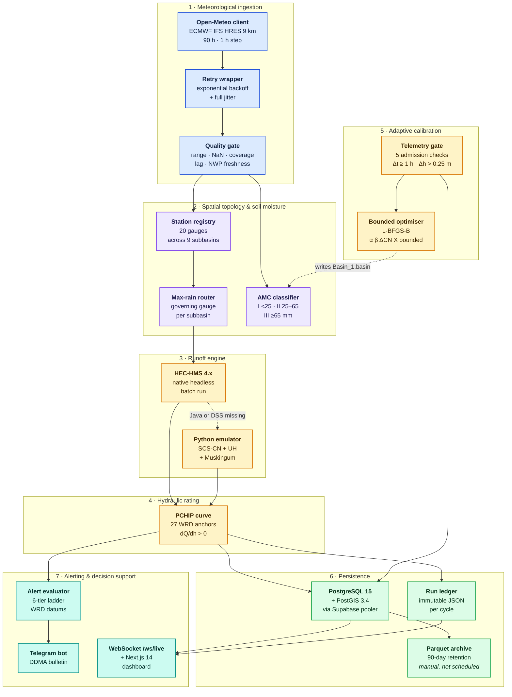
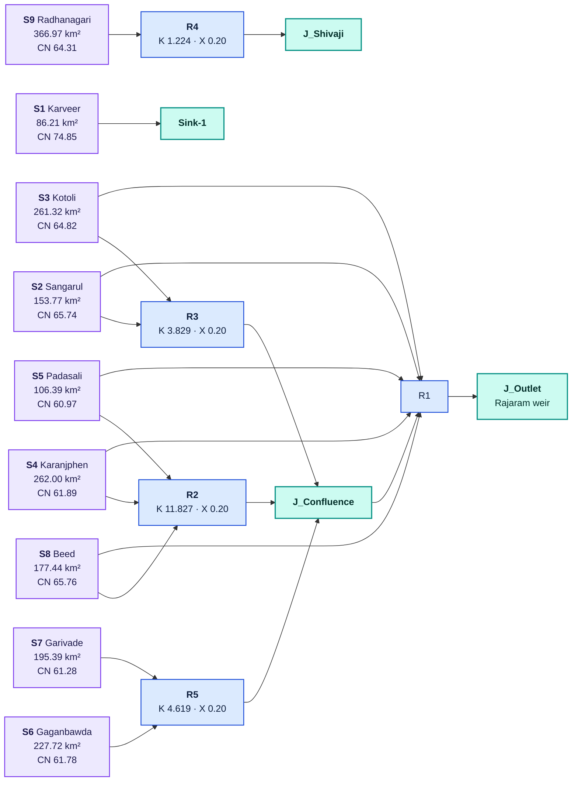

# System Architecture Specification

## Scope of this document

This page is the **specification**: what each layer of the system is, what
boundary it exposes, and what parameters it is configured with. The
[Architecture Atlas](architecture-atlas.md) is the companion **explanatory**
document, with eight annotated flow diagrams that trace a cycle end to end.

Where the two disagree, this page follows the source. Several claims in the
previous version of this document could not be reproduced in the repository —
the basin area, the station count, the reach names, the rainfall bound, and the
optimiser family were all wrong. Those corrections are listed in the
[Engineering Autopsy](errors-and-engineering-assumptions.md).

## 1. What the system is

HydroCast is a rainfall-runoff and flood-intelligence platform for the
Panchganga basin in Western Maharashtra. It ingests a 90-hour quantitative
precipitation forecast, redistributes it across nine gauged subbasins, simulates
loss and channel routing, converts outlet discharge into water level at two
bridges, evaluates the regulatory alert ladder, and dispatches a bulletin to
the district emergency room.

The gauged catchment is **1 837.21 km²**, delineated across nine subbasins and
drained through five Muskingum reaches into a single outlet at the Rajaram
weir. The system runs on a 6-hourly schedule with an hourly telemetry cycle
alongside it.

## 2. Layer inventory

The pipeline is organised as seven layers, each with a narrow responsibility and
a clear input/output contract. The diagram shows how data flows between them;
the text below states what each one owns.



## 3. Layer contracts

### Layer 1 — Meteorological ingestion

`src/ecmwf/open_meteo.py` queries the Open-Meteo REST interface for ECMWF IFS
HRES precipitation on the 9 km grid, lead hours 1 through 90 at hourly
resolution, over the catchment bounding box.

`src/ecmwf/retry_utils.py` wraps the request with exponential backoff and full
jitter, so that concurrent workers do not retry in lockstep and a transient
upstream failure does not cost a cycle.

`src/processing/validator.py` then applies four checks before the data is
allowed to influence the forecast:

| Constant | Value | Meaning |
|---|---|---|
| `MAX_VALID_MM_HR` | 500.0 | Physical upper bound on hourly depth |
| coverage floor | 50 % | Minimum share of the 90 expected hourly records |
| `MAX_LAG_MINUTES` | 60 | Latest gauge record must be within one hour |
| `ECMWF_MAX_AGE_HR` | 8 | ECMWF run must be fresher than eight hours |

!!! note "The previous specification stated a 250 mm/h bound"
        The physical-range check in `src/processing/validator.py` uses
        500 mm/h. Neither value is the official limit — 250 mm/h is a
        plausible Sahyadri extreme and the code permits values well above it.
        The bound exists to catch instrument and transmission faults, and
        should be set from the basin record rather than from a round number.

### Layer 2 — Spatial topology and soil moisture

`src/ecmwf/station_selector.py` holds the registry of **20** stations across
nine subbasins — nine primaries and eleven alternates — and implements the
maximum-precipitation routing rule. The [Rain Gauge Network
page](raingauge-network.md) documents the selection algorithm in full.

Soil moisture is classified by `classify_amc` from the mean 90-hour forecast
rainfall: AMC-I below 25 mm (dry), AMC-II between 25 and 65 mm (average),
AMC-III at or above 65 mm (wet). The class selects a curve number per subbasin
through the TR-55 transforms

$$
CN_{\text{III}} = \frac{23\,CN_{\text{II}}}{10 + 0.13\,CN_{\text{II}}}
\qquad
CN_{\text{I}} = \frac{4.2\,CN_{\text{II}}}{10 - 0.058\,CN_{\text{II}}}
$$

with potential retention `S = 25400/CN - 254` and initial abstraction
`I_a = 0.2 S`.

### Layer 3 — Runoff engine

The engine has two implementations of the same model. The primary path writes
a Jython control script and executes HEC-HMS 4.x headless. The fallback path is
a vectorised pure-Python implementation of SCS-CN loss, SCS unit hydrograph
transform, and Muskingum reach routing, and it is what CI actually runs, since
CI installs neither Java nor HEC-HMS.

Both paths read parameters from `data/hms/HMS_Automation_RJKT/Basin_1.basin`,
which is the single source of truth for both the emulator and the calibration
engine. The emulator produces 352 hourly points before the 90-hour slice is
taken for the published forecast.

!!! warning "`result_source` does not reflect what ran"
        `src/hms/runner.py` never parses `data/hms/compute/Run_1.dss`. The
        emulator result is returned with `result_source = EMULATOR_PYTHON` even
        when the binary reports `COMPLETED_BINARY`, so provenance in the
        persisted run is not reliable.

### Layer 4 — Hydraulic rating

`src/hydrology/stage_converter.py` interpolates the rating curve with
`scipy.interpolate.PchipInterpolator` through 27 WRD anchors spanning
528.67 m to 548.00 m, guaranteeing `dQ/dh > 0` throughout. Rajaram uses the
sheet verbatim; Shivaji uses the same anchors shifted by the surveyed bed
difference of 0.648 m.

A Divided Channel Method implementation based on surveyed cross-sections also
exists in `src/hydrology/rating_curves.py`. It is not on the execution path for
either site.

### Layer 5 — Adaptive calibration

`src/hydrology/realtime_telemetry_validator.py` reads ThingSpeak channel
`3424513`, where an ultrasonic sensor on the Shivaji Bridge deck reports water
level with sensor datum 549.35 m MSL. `src/hydrology/ml_calibration.py` then
compares observed against forecast and, when the discrepancy gate fires
(`|Δt| ≥ 1.0 h` or rising-limb `Δh > 0.25 m`), runs a bounded L-BFGS-B
optimisation over four parameters and writes the result back to
`Basin_1.basin` atomically.

!!! note "Optimiser family"
        The previous specification named Levenberg-Marquardt. The
        implementation calls `scipy.optimize.minimize` with method `L-BFGS-B`.

### Layer 6 — Persistence

`src/db/` writes to PostgreSQL 15 with PostGIS 3.4 over `asyncpg`, trying the
Supabase pooler host before the direct host because GitHub Actions runners are
frequently IPv6-only. Every cycle also writes an immutable JSON document to
`data/runs/{cycle_id}.json`.

`src/db/archive_runs.py` exports series older than `ARCHIVE_RETENTION_DAYS`
(default 90) into Snappy-compressed Parquet partitions under `data/archives/`,
then prunes the source rows in a transaction.

### Layer 7 — Alerting and decision support

`src/alerts/evaluator.py` maps predicted stage onto the six-tier regulatory
ladder and dispatches through `src/alerts/telegram_bot.py` to the DDMA. The
API publishes `/ws/live` for WebSocket push to the Next.js 14 dashboard, and
serves archived run documents when the database is unreachable.

## 4. Pipeline sequence

The orchestrator in `src/orchestrator.py` runs twelve steps per cycle. The
cycle identifier encodes the run, so `CYC_20260901_06z` is the 06z cycle of
1 September 2026.

| Step | Operation | Module |
|---|---|---|
| 1 | Meteorological forcing ingestion, with retry and QC | `src/ecmwf/open_meteo.py` |
| 2 | Gauge fetching and spatial station routing | `src/ecmwf/station_selector.py` |
| 3 | Antecedent moisture classification | `src/hydrology/` |
| 4 | HEC-DSS boundary condition preparation | `src/hms/runner.py` |
| 5 | Recalibration check against live telemetry | `src/hydrology/ml_calibration.py` |
| 6 | Hydrologic watershed runoff execution | `src/hms/runner.py` |
| 7 | Sink outlet hydrograph extraction | `src/hms/runner.py` |
| 8 | Monotonic hydraulic stage conversion | `src/hydrology/stage_converter.py` |
| 9 | Peak arrival window and uncertainty envelope | `src/hydrology/ml_calibration.py` |
| 10 | Accuracy auditing — Spearman ρ, NSE, RMSE, MAE, PBIAS | `src/processing/metrics.py` |
| 11 | Multi-channel emergency alert dispatch | `src/alerts/` |
| 12 | Persistence, archival, and dashboard broadcast | `src/db/` |

!!! warning "`pipeline_ok` is currently always false"
        The success predicate checks for **10** successful steps while the step
        list contains **12** entries, so a cycle that completes cleanly is
        still reported as failed. Steps 7 and 8 are also executed twice in the
        orchestrator body, which inflates the step log. Both are described in
        the [Production Hardening Roadmap](roadmap.md).

### Scheduling

| Workflow | Cadence | Command |
|---|---|---|
| `pipeline.yml` | 02:30, 08:30, 14:30, 20:30 UTC | `python -m src.ecmwf.open_meteo` |
| `telemetry_validation.yml` | Hourly, minute 0 | `python -m src.hydrology.realtime_telemetry_validator --all-pending` |
| `tests.yml` | On push and pull request | `python -m pytest -q` |

!!! note "The scheduled command is not the orchestrator"
        `pipeline.yml` invokes `python -m src.ecmwf.open_meteo` and the
        downstream modules directly. The twelve-step orchestrator is not what
        runs on the schedule.

## 5. Basin parameters

Parameters below are read from
`data/hms/HMS_Automation_RJKT/Basin_1.basin` by `src/hms/basin_parser.py`.

| Subbasin | Name | Area (km²) | Baseline CN | Lag (min) | Registered primary station |
|---|---|---|---|---|---|
| S1 | Karveer (outlet) | 86.213 | 74.85 | 2 152.0 | `KARVEER` |
| S2 | Sangarul | 153.770 | 65.74 | 3 154.3 | `SANGARUL` |
| S3 | Kotoli | 261.320 | 64.82 | 3 997.7 | `KOTOLI` |
| S4 | Karanjphen | 262.000 | 61.89 | 3 115.5 | `KARANJPHEN` |
| S5 | Padasali | 106.390 | 60.97 | 2 117.1 | `PADASALI` |
| S6 | Gaganbawda | 227.720 | 61.78 | 3 318.1 | `GAGANBAWDA` |
| S7 | Garivade | 195.390 | 61.28 | 3 362.3 | `GARIVADE` |
| S8 | Beed | 177.440 | 65.76 | 3 387.1 | `BEED` |
| S9 | Radhanagari | 366.970 | 64.31 | 5 199.0 | `RADHANAGARI` |

The reaches are identified in the basin file only by ID, storage constant, and
connectivity. The descriptive names that appeared in earlier revisions of this
page were not present in the source.

| Reach | Upstream inflow | Downstream outflow | K (h) | X |
|---|---|---|---|---|
| R5 | S6, S7 | `J_Confluence` | 4.619 | 0.20 |
| R4 | S9 | `J_Shivaji` | 1.224 | 0.20 |
| R2 | S8, S4, S5 | `J_Confluence` | 11.827 | 0.20 |
| R3 | S3, S2 | `J_Confluence` | 3.829 | 0.20 |
| R1 | S8, S4, S5, S2, S3 | `J_Outlet` | 2.899 | 0.20 |



Subbasin S1 drains directly to the sink with no reach routing, which is
consistent with its position at the outlet. Every other subbasin reaches the
sink through at least one Muskingum reach.

## 6. Official reference datums

All regulatory levels are expressed against the WRD zero gauge datum of
**530.18 m MSL**.

| Regulatory level | Stage (m MSL) | Discharge (m³/s) | Tier |
|---|---|---|---|
| Zero gauge datum | 530.18 | 0 | `dry` |
| Normal monsoon level | 533.28 | 109.2 | `normal` |
| Rajaram weir crest | 535.77 | 274.4 | `normal` |
| Rajaram alert | 541.50 | 1 480.0 | `alert` |
| Shivaji alert | 542.10 | 1 800.0 | `alert` |
| Warning | 542.70 | 2 200.0 | `warning` |
| Danger | 543.30 | 2 675.0 | `danger` |
| Highest flood level (2019) | 545.33 | 3 850.0 | `hfl_exceeded` |

```text
  Elevation Profile of Bridge Gauge Stations:

  546 m +                                     ================================= HFL (2019): 545.33 m MSL
        |
  544 m +                                     --------------------------------- Danger Level: 543.30 m MSL
        |                                     - - - - - - - - - - - - - - - - Warning Level: 542.70 m MSL
  542 m +                                     . . . . . . . . . . . . . . . . . Shivaji Alert: 542.10 m MSL
        |                                     . . . . . . . . . . . . . . . . . Rajaram Alert: 541.50 m MSL
  536 m +                      ~~~~~~~~~~~~~~ Weir Crest Level: 535.77 m MSL
        |
  533 m +     ~~~~~~~~~~~~~~~~~~~~~~~~~~~~~~~ Normal Monsoon Stage: 533.28 m MSL (Q ~ 109 m3/s)
        |
  530 m +==== River Bed Zero Datum: 530.18 m MSL (0' 0" Gauge Mark) =======================================
```

The uncertainty envelope reported with each peak is computed as

$$
\text{stage margin} = 0.12 + 0.03\,(\,h_{\text{peak}} - 535\,)
$$

metres either side of the peak, with discharge bounded to ±6 % of the rating
value. The arrival window is `T_peak ± 2.0 h`, from `PEAK_ARRIVAL_CI_HOURS`
with a default of 2.0.

## 7. Technology stack

| Layer | Technology | Function |
|---|---|---|
| NWP data | ECMWF IFS HRES 9 km via Open-Meteo REST | 90-hour QPF forecast |
| Ingestion | `requests`, `openmeteo-requests`, SQLite cache | Backoff, jitter, QC bounds |
| Hydrology | HEC-HMS 4.x + Python emulator | SCS-CN loss, UH transform, Muskingum routing |
| Hydraulics | `scipy.interpolate.PchipInterpolator` | Monotone rating curves |
| Calibration | `scipy.optimize.minimize`, NumPy | Bounded L-BFGS-B parameter fit |
| Telemetry | ThingSpeak channel `3424513` | Ultrasonic level at Shivaji Bridge |
| Database | PostgreSQL 15 + PostGIS 3.4, Supabase pooler | Cycles, hydrographs, step logs |
| Archival | PyArrow, Apache Parquet | Columnar retention export |
| API | FastAPI, Uvicorn, asyncpg | REST endpoints and WebSocket push |
| Security | PyJWT (HS256), `slowapi`, `hmac.compare_digest` | Admin auth, 100 req/min limit |
| Alerting | Telegram Bot API, HTTP webhooks | DDMA bulletins |
| Frontend | Next.js 14 App Router, React 18, Tailwind | Operations dashboard |
| Deployment | Docker, Docker Compose | Three-service reproducible stack |
| CI/CD | GitHub Actions | Scheduled cycles and tests |

## 8. Deployment

```yaml
services:
  hydrocast-db:        # postgis/postgis:15-3.4
  hydrocast-backend:   # Python 3.12 + FastAPI
  hydrocast-frontend:  # Next.js 14 standalone
  hydrocast-net:       # private bridge
```

The backend `Dockerfile` builds wheels in a stage that carries OpenJDK 17,
`libgdal-dev` and `libeccodes-dev`, and runs a minimal runtime image as a
non-root user with a health probe against `/api/v1/health`. The frontend
`Dockerfile` produces a Node 20 Alpine standalone server. Schema initialisation
comes from `database/supabase_schema.sql`.

## 9. API surface

Public reads are rate-limited to `RATE_LIMIT_PUBLIC` (default `100/minute`,
keyed on remote address) and gated by `verify_public_or_key`. Administrative
routes under `/api/v1/admin` require either an HMAC-SHA256 JWT bearer token from
`POST /api/v1/admin/auth/token` — compared with `hmac.compare_digest`, valid 24
hours — or an `X-API-Key` header matching `API_KEY`.

| Route | Purpose |
|---|---|
| `GET /api/v1/health` | Service and last-run status |
| `GET /api/v1/status` | Current cycle state |
| `GET /api/v1/rainfall/*` | Gauge and subbasin rainfall series |
| `GET /api/v1/runoff/*` | Hydrographs, subbasins, reaches |
| `GET /api/v1/stage` | Bridge stage forecast and peak window |
| `GET /api/v1/calibration` | Calibration state and bounds |
| `GET /api/v1/dss` | Run file listing |
| `POST /api/v1/admin/trigger-run` | Manual cycle trigger |
| `POST /api/v1/admin/archive` | Trigger Parquet archival |
| `POST /api/v1/admin/recalibrate` | Force recalibration |
| `WS /ws/live` | Live cycle and threshold push |

For the generated reference of every endpoint, see the API reference section in
the navigation.