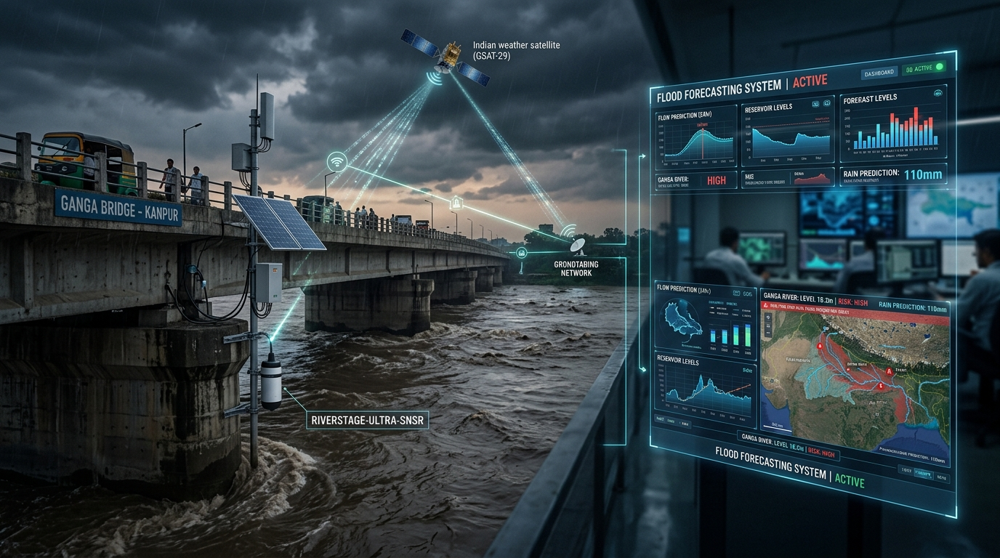

# HydroCast Technical Documentation Library

  

  

Welcome to the comprehensive technical documentation for **HydroCast: Real-Time Operational Flood Forecasting & Basin Intelligence** for the Panchganga River Catchment (Kolhapur District, Maharashtra, India).

<link rel="stylesheet" href="https://unpkg.com/leaflet@1.9.4/dist/leaflet.css" />

## Technology & Engineering Stack

| Area | Tool |
| :--- | :--- |
| **OS** |    |
| **Languages** |        |
| **Frameworks** |      |
| **Hydrology & ML** |       |
| **Databases & Archival** |     |
| **IoT & Alerting** |     |
| **Infrastructure** |     |

---

## Technical Modules

| Module | Document | Description |
| :--- | :--- | :--- |
| **System Architecture** | [`architecture.md`](./architecture.md) | 12-Step operational prediction pipeline, ML recalibration loop, multi-container Docker, and cold storage. |
| **API & Backend** | [`backend.md`](./backend.md) | FastAPI REST services, SlowAPI rate limiting, admin JWT tokens, manual triggers, and WebSockets. |
| **Frontend Dashboard** | [`frontend.md`](./frontend.md) | Next.js 14 App Router, Peak Flood Strike Horizon (±2.0h CI), 2D SVG Cross-Section, and Docker runtime. |
| **Database Architecture** | [`database.md`](./database.md) | PostgreSQL production schema, `pipeline_step_log`, Supabase cloud sync, and Parquet cold storage. |
| **Open-Meteo & ECMWF** | [`open-meteo-ecmwf.md`](./open-meteo-ecmwf.md) | ECMWF IFS HRES 9km QPF ingestion, enterprise exponential backoff retry wrappers, and station routing. |
| **Rain Gauge Network** | [`raingauge-network.md`](./raingauge-network.md) | 18 primary and alternate stations, geographical topology, and dynamic selection. |
| **Basin Hydrology** | [`basin-hydrology.md`](./basin-hydrology.md) | 1,837.2 km² Panchganga basin physiography, subbasins S1–S9, SCS-CN, SCS Dimensionless UH, and closed-loop ML recalibration. |
| **Runoff Computation** | [`runoff-computation.md`](./runoff-computation.md) | Mathematical runoff continuum, SCS-CN loss, SCS unit hydrograph convolution, and Muskingum reach routing. |
| **HEC-HMS Automation** | [`hec-hms-engine.md`](./hec-hms-engine.md) | Headless USACE HEC-HMS 4.13 batch runner, `Basin_1.basin` parser, pure-Python emulator with AMC-I/II/III antecedent moisture, SCS-CN loss, SCS-UH, Muskingum routing, and baseflow recession. |
| **River Hydraulics** | [`hydraulics.md`](./hydraulics.md) | Divided Channel Method ($n_{\text{main}}=0.031, n_{\text{flood}}=0.070$), surveyed bed slopes ($1:2529, 1:4641, 1:7700$), and K.T. weir hydraulics. |
| **Rating Curves** | [`stage-discharge-conversion.md`](./stage-discharge-conversion.md) | Bi-directional monotonic PCHIP rating curves ($dQ/dh > 0$) for Shivaji Bridge & Rajaram Weir. |
| **Model Calibration** | [`calibration-validation.md`](./calibration-validation.md) | Spearman rank $\rho$, NSE, PBIAS, real-time ML optimization, and WRD benchmark calibration. |
| **ML Calibration Engine** | [`ml-calibration-engine.md`](./ml-calibration-engine.md) | Details the Physics-Informed Machine Learning engine that fits Levenberg–Marquardt parameters in-memory against the emulator, using the HEC-HMS basin file as the immutable physical ground truth. |
| **Rainfall Validation** | [`rainfall-validation-pipeline.md`](./rainfall-validation-pipeline.md) | Observed rainfall ingestion, ground truth telemetry verification, and QC checks. |
| **WRD Ground Truth** | [`wrd-rating-curve-cross-check.md`](./wrd-rating-curve-cross-check.md) | Historical flood marks cross-verification vs Maharashtra WRD government records. |
| **IoT Telemetry** | [`iot-telemetry.md`](./iot-telemetry.md) | ThingSpeak ultrasonic radar level sensor, 549.35m datum, live stage polling, observation-gap lifecycle states, and ML recalibration integration. |
| **GIS Vector Layers** | [`gis-vector-layers.md`](./gis-vector-layers.md) | GeoJSON subbasin delineations, stream network routing, and DEM processing. |
| **Engineering Autopsy** | [`errors-and-engineering-assumptions.md`](./errors-and-engineering-assumptions.md) | Historical post-mortem of bed slope distortion, wetted perimeter collapse, and v3.0 edge-case mitigations. |
| **System Novelty** | [`novelty-of-this-system.md`](./novelty-of-this-system.md) | 12 core scientific and architectural innovations of HydroCast vs traditional warning systems. |
| **PI Research Report** | [`accuracy-analysis-pi-report.md`](./accuracy-analysis-pi-report.md) | Formal research report prepared for the Principal Investigator on model accuracy. |
| **Production Roadmap** | [`roadmap.md`](./roadmap.md) | 5 Open-source production hardening pillars: Dockerization, alerting, archival, security, and retries. |
| **Operations Manual** | [`deployment-operations.md`](./deployment-operations.md) | Docker Compose multi-container, DDMA Telegram bot dispatch, scheduled Parquet pruning, and NGINX setup. |

