# HydroCast Technical Documentation

  

  

## What this system is

HydroCast is a rainfall-runoff and flood-early-warning platform for the
Panchganga river catchment in Kolhapur district, Maharashtra. It takes a
90-hour numerical weather prediction, routes it through a calibrated
nine-subbasin hydrologic model, converts the resulting discharge into a water
level against the Maharashtra Water Resources Department rating sheet, and
compares that water level against a live ultrasonic sensor on the Shivaji
Bridge deck. When the comparison shows the model arrived at the wrong time or
the wrong height, the model parameters are re-fitted and written back to disk
before the next cycle.

That last step is what separates this from a conventional flood forecast. Most
published systems treat the model as fixed once calibrated and simply report
what it produced. HydroCast closes the loop: the river is allowed to correct
the model, but only when the river is genuinely rising, and only inside
bounded parameter ranges.

The catchment is 1 837.21 km² of gauged area divided into nine subbasins and
drained through five Muskingum reaches to a single outlet at the Rajaram weir.
Two sites carry regulatory meaning — the Rajaram K.T. weir and the
Chhatrapati Shivaji Maharaj Bridge 3 858 m upstream of it — and both are
converted to stage in metres above mean sea level so that a district officer
can read the number off a gauge board.

## How to read these documents

The documentation is organised around the direction water travels, not around
the repository layout. If you want to understand the system, read it in this
order; each stage has a page that carries both the derivation and the
engineering flow diagram.

```mermaid
flowchart LR
    subgraph A["UNDERSTAND THE PROBLEM"]
        direction TB
        A1["<b>Project Background</b><br/>why this catchment, why now"]
        A2["<b>System Novelty</b><br/>what is different here"]
    end
    subgraph B["UNDERSTAND THE SYSTEM"]
        direction TB
        B1["<b>Architecture Atlas</b><br/>8 engineering flow diagrams<br/>start here"]
        B2["<b>System Architecture</b><br/>modules, parameters, datums"]
    end
    subgraph C["UNDERSTAND THE PHYSICS"]
        direction TB
        C1["<b>Runoff Computation</b><br/>SCS-CN · UH · Muskingum"]
        C2["<b>HEC-HMS Engine</b><br/>basin file &amp; emulator"]
        C3["<b>Stage-Discharge</b><br/>WRD PCHIP rating"]
    end
    subgraph D["UNDERSTAND THE EVIDENCE"]
        direction TB
        D1["<b>Calibration &amp; Validation</b><br/>NSE, rho, PBIAS"]
        D2["<b>ML Calibration Engine</b><br/>Levenberg-Marquardt fit"]
        D3["<b>IoT Telemetry</b><br/>sensor &amp; lifecycle states"]
        D4["<b>Engineering Autopsy</b><br/>known failure modes"]
    end

    A1 --> A2 --> B1 --> B2
    B2 --> C1 --> C2 --> C3
    C3 --> D1 --> D2 --> D3 --> D4

    classDef orient fill:#dbeafe,stroke:#2563eb,stroke-width:1.5px,color:#0c1a3a
    classDef core   fill:#ede9fe,stroke:#7c3aed,stroke-width:2px,color:#1e1b4b
    classDef evid   fill:#ccfbf1,stroke:#0d9488,stroke-width:1.5px,color:#04302b

    class A1,A2 orient
    class B1,B2,C1,C2,C3 core
    class D1,D2,D3,D4 evid
```

!!! tip "If you only read one page"
    Read the [Architecture Atlas](architecture-atlas.md). Every figure there
    appears twice — a compact ASCII overview that always renders, and a Mermaid
    diagram carrying the governing equation, the parameter value, the
    threshold, the implementing module, and the branch taken when something
    fails. The diagrams describe what the code actually does, including the
    places where it departs from the design.

## The catchment

<link rel="stylesheet" href="https://unpkg.com/leaflet@1.9.4/dist/leaflet.css" />

## Technology & Engineering Stack

| Area | Tool |
| :--- | :--- |
| **OS** |    |
| **Languages** |        |
| **Frameworks** |      |
| **Hydrology & ML** |       |
| **Databases & Archival** |     |
| **IoT & Alerting** |     |
| **Infrastructure** |     |

## Technical Modules

The table below is an index. The descriptions state what each page is *for*;
the pages themselves carry the derivations and the annotated flow diagrams.

| Module | Document | What it covers |
| :--- | :--- | :--- |
| **System Diagrams** | [`architecture-atlas.md`](./architecture-atlas.md) | Eight engineering flow diagrams spanning forcing, ingestion, the 12-step pipeline, hydrologic topology, the runoff computation, the rating curve, the closed telemetry loop, data lineage, and deployment. Start here. |
| **System Architecture** | [`architecture.md`](./architecture.md) | Module inventory, the parameter tables, the official WRD datum table, and the security and archival specifications. |
| **API & Backend** | [`backend.md`](./backend.md) | FastAPI REST services, SlowAPI rate limiting, admin JWT tokens, manual run triggers, and the `/ws/live` WebSocket. |
| **Frontend Dashboard** | [`frontend.md`](./frontend.md) | Next.js 14 App Router, the Peak Flood Strike Horizon card with its ±2.0 h window, the 2D SVG cross-section viewer, and the Docker runtime. |
| **Database Architecture** | [`database.md`](./database.md) | The ten-table PostgreSQL schema, `pipeline_step_log`, Supabase sync, and Parquet cold storage. |
| **Open-Meteo & ECMWF** | [`open-meteo-ecmwf.md`](./open-meteo-ecmwf.md) | ECMWF IFS HRES 9 km QPF ingestion, exponential backoff with full jitter, physical range checks, and station routing. |
| **Rain Gauge Network** | [`raingauge-network.md`](./raingauge-network.md) | The 20 registered gauges, their elevations, the dynamic per-cycle selection rule, and the quality gate. |
| **Basin Hydrology** | [`basin-hydrology.md`](./basin-hydrology.md) | The 1 837.21 km² physiography, subbasins S1–S9, the SCS-CN loss model, the dimensionless unit hydrograph, and the closed-loop recalibration. |
| **Runoff Computation** | [`runoff-computation.md`](./runoff-computation.md) | The full runoff continuum with equations: SCS-CN loss, AMC transforms, unit hydrograph convolution, Muskingum routing, and baseflow recession. |
| **HEC-HMS Automation** | [`hec-hms-engine.md`](./hec-hms-engine.md) | The headless batch runner, the `Basin_1.basin` parser, and the calibrated pure-Python emulator that is the actual production path. |
| **River Hydraulics** | [`hydraulics.md`](./hydraulics.md) | Divided Channel Method ($n_{\text{main}}=0.031$, $n_{\text{flood}}=0.070$), surveyed bed slopes, and K.T. weir hydraulics. |
| **Rating Curves** | [`stage-discharge-conversion.md`](./stage-discharge-conversion.md) | Bi-directional monotonic PCHIP rating curves ($dQ/dh > 0$) for both gauged sites, and the six-level alert ladder. |
| **Model Calibration** | [`calibration-validation.md`](./calibration-validation.md) | Spearman rank $\rho$, Nash-Sutcliffe efficiency, PBIAS, and WRD benchmark calibration. |
| **ML Calibration Engine** | [`ml-calibration-engine.md`](./ml-calibration-engine.md) | The Levenberg-Marquardt parameter fit, its discrepancy gate, box bounds, and atomic write-back. |
| **Rainfall Validation** | [`rainfall-validation-pipeline.md`](./rainfall-validation-pipeline.md) | Observed rainfall ingestion, gauge coverage and lag checks, and the volumetric fidelity audit. |
| **WRD Ground Truth** | [`wrd-rating-curve-cross-check.md`](./wrd-rating-curve-cross-check.md) | Historical flood marks cross-verified against Maharashtra WRD government records. |
| **IoT Telemetry** | [`iot-telemetry.md`](./iot-telemetry.md) | The ThingSpeak channel, the 549.35 m datum, hourly caching, and the run lifecycle states. |
| **GIS Vector Layers** | [`gis-vector-layers.md`](./gis-vector-layers.md) | GeoJSON subbasin delineations, the stream network, and DEM processing. |
| **Engineering Autopsy** | [`errors-and-engineering-assumptions.md`](./errors-and-engineering-assumptions.md) | Post-mortems of past modelling errors, the physical approximations still in force, and the edge-case mitigations added in v3.x. |
| **System Novelty** | [`novelty-of-this-system.md`](./novelty-of-this-system.md) | Twelve core scientific and architectural innovations, and how they compare to a conventional warning system. |
| **PI Research Report** | [`accuracy-analysis-pi-report.md`](./accuracy-analysis-pi-report.md) | The formal accuracy report prepared for the Principal Investigator. |
| **Production Roadmap** | [`roadmap.md`](./roadmap.md) | Five open-source production hardening pillars and what remains before operational handover. |
| **Operations Manual** | [`deployment-operations.md`](./deployment-operations.md) | Docker Compose orchestration, Telegram dispatch, scheduled Parquet pruning, and reverse-proxy setup. |
