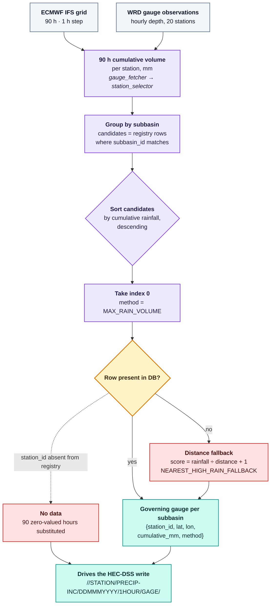

# Panchganga Rain Gauge Network & Station Routing

The Panchganga catchment presents a rainfall field that is hostile to
substitution. The western edge sits on the Sahyadri escarpment at Gaganbawda,
680 m above sea level, taking roughly 5 000 mm of rain a year; the eastern
outlet at Karveer sits on the Kolhapur plain at 550 m. Across a basin barely
100 km wide, that gradient is steep enough that a single representative gauge
would be meaningless — the difference between the crest and the valley floor is
often a factor of three in storm totals, and it is the crest that generates the
flood.

That is the problem the gauge network solves. Twenty stations are registered
across the catchment, nine subbasins are delineated to match, and on every
forecast cycle the system decides *which* of those gauges governs each
subbasin. The rule is deliberately one-sided, and understanding why it is
one-sided is the whole point of this page.

## 1. Station registry and subbasin assignment

`STATION_REGISTRY` in `src/ecmwf/station_selector.py` holds all twenty
stations. Nine are flagged `is_primary=True` — exactly one per subbasin — and
eleven are alternates that exist to be *competed against* rather than to be
used directly.

| # | Station ID | Name | Subbasin | Subbasin Area | Elevation | Longitude | Latitude | Role |
|---|---|---|---|---|---|---|---|---|
| 01 | `KARVEER` | Karveer | S1 | 86.213 km² | 550 m | 74.248177° | 16.706369° | Primary governing |
| 02 | `SANGARUL` | Sangarul | S2 | 153.770 km² | 572 m | 74.093163° | 16.684196° | Primary governing |
| 03 | `BALINGA` | Balinga | S2 | — | 560 m | 74.170310° | 16.687844° | Alternate |
| 04 | `KALE` | Kale | S2 | — | 580 m | 74.056450° | 16.722809° | Alternate |
| 05 | `KOTOLI` | Kotoli | S3 | 261.320 km² | 585 m | 74.051871° | 16.782017° | Primary governing |
| 06 | `BAJAR_BHOGAON` | Bajar Bhogaon | S3 | — | 590 m | 74.110782° | 16.808677° | Alternate |
| 07 | `PADAL` | Padal | S3 | — | 575 m | 74.115187° | 16.744601° | Alternate |
| 08 | `KARANJPHEN` | Karanjphen | S4 | 262.000 km² | 640 m | 73.903649° | 16.785097° | Primary governing |
| 09 | `PADASALI` | Padasali | S5 | 106.390 km² | 620 m | 73.843584° | 16.701934° | Primary governing |
| 10 | `SALWAN` | Salwan | S5 | — | 595 m | 73.973500° | 16.671200° | Alternate |
| 11 | `GAGANBAWDA` | Gaganbawda | S6 | 227.720 km² | 680 m | 73.834674° | 16.546993° | Primary governing |
| 12 | `GARIVADE` | Garivade | S7 | 195.390 km² | 610 m | 73.918419° | 16.520366° | Primary governing |
| 13 | `BEED` | Beed | S8 | 177.440 km² | 565 m | 74.128896° | 16.647984° | Primary governing |
| 14 | `SHIROLI_DHUMALA` | Shiroli-Dhumala | S8 | — | 560 m | 74.106283° | 16.616677° | Alternate |
| 15 | `RADHANAGARI` | Radhanagari | S9 | 366.970 km² | 615 m | 73.997182° | 16.410210° | Primary governing |
| 16 | `HALADI` | Haladi | S9 | — | 555 m | 74.156292° | 16.593263° | Alternate |
| 17 | `RASHIWADE_BK` | Rashiwade Bk. | S9 | — | 570 m | 74.101973° | 16.547564° | Alternate |
| 18 | `AAVALI_BK` | Aavali Bk. | S9 | — | 585 m | 74.054981° | 16.481009° | Alternate |
| 19 | `KASABA_TARALE` | Kasaba Tarale | S9 | — | 595 m | 74.021589° | 16.447888° | Alternate |
| 20 | `KASABA_WALAWE` | Kasaba Walawe | S9 | — | 615 m | 73.997182° | 16.410210° | Alternate |

The nine subbasin areas sum to **1 837.213 km²** of gauged area. The catchment
is not evenly sampled: S9 Radhanagari alone covers 20 % of the basin and has
six candidate gauges, while S1, S4, S6 and S7 have one each and no alternate
at all. For those four subbasins the "dynamic" selection has nothing to
choose between, and the primary station governs by default.

!!! note "KASABA_WALAWE duplicates RADHANAGARI's coordinates"
    Both are registered at 73.9971822° E, 16.41021° N. The last row of the
    table above is therefore not an independent observation — it is the same
    physical location under a second identifier. In a cycle where RADHANAGARI
    is the wettest station, the tie is broken by sort order, and both entries
    report the same depth.

## 2. The orographic gradient the network has to span

```text
========================================================================================================================
                 PANCHGANGA BASIN RAIN GAUGE NETWORK & SUBBASIN ROUTING TOPOLOGY
========================================================================================================================

  Elevation & Orographic Rainfall Gradient (West to East):
  Altitude (m MSL)
   700 +   [ GAGANBAWDA (680m) ]  <-- Crest of Western Ghats (Highest Rainfall Zone ~5,000 mm/year)
       |   [ KARANJPHEN (640m) ]  [ PADASALI (620m) ]
   600 +   [ RADHANAGARI (615m) ] [ GARIVADE (610m) ] [ KOTOLI (585m) ]
       |   [ SANGARUL (572m) ]    [ BEED (565m) ]     [ KASABA TARALE (595m) ]
   550 +---------------------------------------------- [ KARVEER (550m) ] <-- Valley Floor / Outlet
       +----------------------------------------------------------------------------------------->
       West (Sahyadri Escarpment)                                          East (Kolhapur Plains)
```

The subbasin layout is not arbitrary. S6 Gaganbawda, on the crest, is the
wettest subbasin in the basin and drains through R5; S1 Karveer, on the valley
floor at the outlet, is the driest and drains straight to the sink with no
reach routing at all. Between them the rainfall field varies by more than an
order of magnitude in annual totals, which is why the router is allowed to
choose a different governing station for the same subbasin on consecutive
cycles.

## 3. Dynamic conservative station selection

The selection rule is one line of intent: **for each subbasin, use the station
with the largest 90-hour cumulative rainfall.** No averaging, no
distance-weighted blend, no persistence of yesterday's choice.

The justification is asymmetric risk. Under-predicting rainfall produces a
hydrograph that arrives late, which means an evacuation ordered against it is
ordered too late — the failure mode that kills people. Over-predicting rainfall
produces a hydrograph that arrives early and peaks high, which produces a
warning that was not needed. Of those two outcomes, one is a near-miss and the
other is a disaster, so the router is biased hard toward the first.



The implementation in `select_active_subbasin_gages()` records, for each
subbasin, the selected station's identity, coordinates, the cumulative depth
that won the comparison, the method string `MAX_RAIN_VOLUME`, and the number of
candidates it chose from. That record is written to `station_selection_log` so
a forecast can be audited afterwards: given the cycle ID, you can recover which
gauge drove which subbasin and why.

### When the primary station is not the right one

Three subbasins demonstrate why the alternates exist.

**S5 Padasali** is the clearest case. Padasali sits at 620 m on the western
crest; Salwan, the alternate, sits at 595 m on the valley side. During a
western Ghats storm front the two can differ by a factor of three — 48.7 mm
against 16.5 mm over the same 90-hour window. A static assignment to Salwan
would under-runoff the Kumbhi basin by two thirds in exactly the events that
matter.

**S4 Karanjphen** and **S7 Garivade** are headwater subbasins with no
alternate registered. Karanjphen at 640 m is the second-highest station in the
network and drains 262 km² directly; Garivade at 610 m drains 195 km². Both
feed headwater tributaries — Kumbhi, Dhamani, Kasari, Bhogawati and Tulsi — so
a gauge failure here has nowhere to fall back to and the subbasin is fed a
centroid-derived estimate instead.

**S9 Radhanagari** is the opposite case: 366.97 km² including the reservoir
drainage zone, with six candidate gauges spread across it. The maximum-volume
router is what lets the model track a localised convective cloudburst over the
reservoir catchment rather than averaging it away across the subbasin.

## 4. The quality gate on gauge data

Selection only runs on data that has already passed validation. The gate lives
in `src/processing/validator.py` and applies four checks, any of which can mark
a gauge degraded:

| Check | Threshold | Rationale |
|---|---|---|
| Physical range | depth ≤ 500 mm/h | Values above this are instrument or transmission faults, not rain. The Panchganga record maximum is far below it. |
| Coverage | ≥ 50 % of the 90 expected hourly records | A gauge reporting 20 hours cannot support a 90-hour hyetograph. |
| Gauge lag | latest record ≤ 60 min old | A stale gauge is indistinguishable from a failed one, and its 90-hour total is a partial sum presented as a complete one. |
| NWP freshness | ECMWF data ≤ 8 h old | The forecast must not be built on a superseded model run. |

!!! warning "A failed gauge does not abort the cycle"
    Only a *critical* validation failure raises `ValueError` in step 3 of the
    orchestrator and takes the whole run down. Coverage and lag failures are
    recorded as warnings in the validation report and the cycle continues,
    because a partially-degraded catchment is more useful than no forecast at
    all during a flood. The distinction is deliberate and is the reason the
    physical-range check is separated from the rest.

!!! warning "The S1 fallback references a station that does not exist"
    The per-subbasin fallback in the orchestrator pipeline defaults
    `selected_station_id` to `"KARVIR"`. That identifier is not in
    `STATION_REGISTRY`, which uses `KARVEER`; `Met_1.met` and the `.gage` file
    use a third spelling, `Karvir`. When the fallback path is taken for S1, the
    lookup misses and `station_time_series.get("KARVIR", np.zeros(90))` silently
    substitutes 90 zero-valued hours — 45 mm of phantom rainfall attributed to
    the outlet subbasin, with no error raised.
