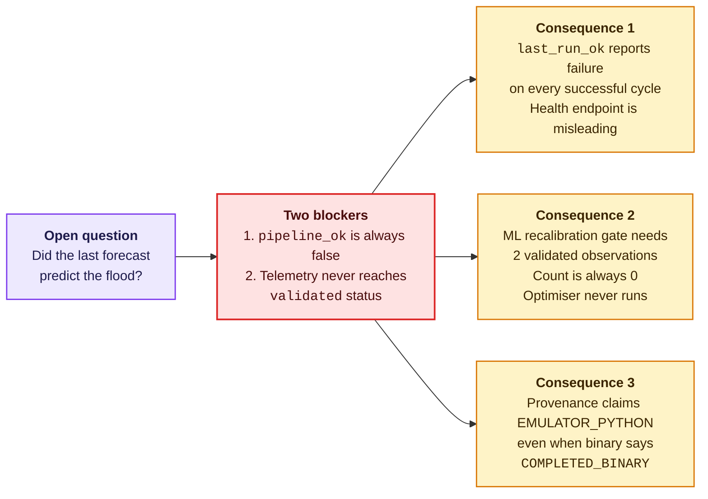
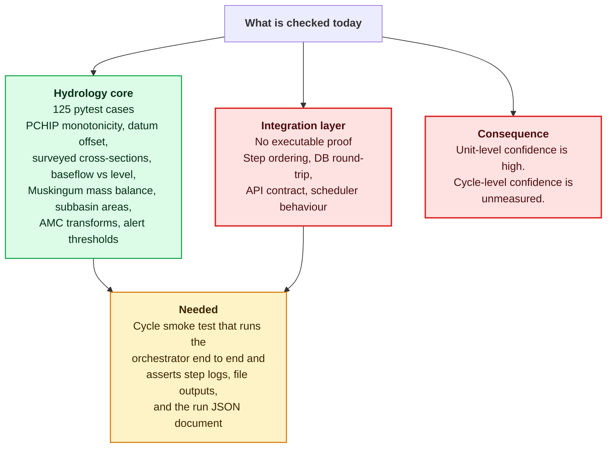

# Production Hardening Roadmap

## Where the system actually stands

HydroCast runs end to end. Each 6-hourly cycle fetches ECMWF IFS HRES
precipitation, selects a governing gauge per subbasin, simulates runoff and
reach routing, converts discharge to stage at two sites, evaluates the alert
ladder, persists the result, and pushes to Telegram and a live dashboard. The
five "hardening pillars" below were originally written as a plan to get from a
functional prototype to a production platform, and the bulk of them were
delivered.

This page has been rewritten to reflect the code rather than the original plan.
Several items previously listed as complete are not: the closed-loop
recalibration trigger, the pipeline success flag, and result provenance all
have integration gaps. Those gaps are what the roadmap is now actually about,
and they are ordered by how much damage they do if left alone.

## The gap that motivates everything

The system computes a forecast and publishes a warning. It does not currently
reliably know whether that forecast was any good, and it does not reliably
report what produced it. Those two facts are worth stating plainly, because
everything below is a consequence of them.

## 1. Orchestration integrity — highest priority

The orchestrator runs twelve steps and logs twelve. The success predicate
checks for ten. `pipeline_ok` is therefore false on every cycle that completes
cleanly, which makes `/api/v1/health` report a healthy system as failing and
makes the Telegram status message wrong.

This is a small change with an outsized effect on operational trust: the first
thing any operator checks after deploying is whether the system says it ran.

| Task | Status | Touches |
| :--- | :---: | :--- |
| Reconcile expected step count with the actual step list | Open | `src/orchestrator.py` |
| Remove the duplicate execution of HMS steps 07 and 08 | Open | `src/orchestrator.py` |
| Make `result_source` reflect the parsed DSS file, not the binary's exit code | Open | `src/hms/runner.py` |
| Keep the exponential-backoff retry wrapper around Open-Meteo ingestion | Done | `src/ecmwf/open_meteo.py` |
| Scheduled 4×/day workflow | Done | `.github/workflows/pipeline.yml` |

!!! note "Why the count mismatch exists"
        The step list grew as features landed — telemetry validation, archive
        sync, step-log finalisation — and the constant used for the success
        check did not move with it. The correct fix is to assert against
        `len(STEPS)` rather than to edit the number, so the next feature cannot
        reintroduce it.

## 2. Telemetry status promotion

The ML recalibration gate requires two observations with `status = 'validated'`.
The pipeline writes `fresh`. Nothing in between exists.

Closing this is what turns the closed loop from documentation into behaviour.
The promotion needs a real quality check — range, rate-of-change, and
cross-agreement against the forecast stage are reasonable gates — and the
circularity noted below has to be resolved at the same time, because a loop
that compares the rating curve to itself will converge to "always fine" and
disable itself.

| Task | Status | Touches |
| :--- | :---: | :--- |
| Add a `fresh → validated` promotion step with explicit acceptance criteria | Open | `src/hydrology/realtime_telemetry_validator.py` |
| Compute recalibration discrepancy in stage domain, or from independent discharge | Open | `src/hydrology/ml_calibration.py` |
| Add the hourly promotion workflow to the main pipeline, not only the telemetry workflow | Open | `.github/workflows/pipeline.yml` |
| Five-gate admission check (range, rate, staleness, cross-site, NWP freshness) | Done | `src/hydrology/realtime_telemetry_validator.py` |
| Atomic `.bak` + `os.replace` write-back | Done | `src/hydrology/ml_calibration.py` |
| Hourly telemetry validation workflow | Done | `.github/workflows/telemetry_validation.yml` |

## 3. Executable correctness checks

A production system needs checks that fail loudly rather than degrade quietly.
Most of the hydrologic core already has them; the integration layer mostly
does not.

The highest-value addition is a single end-to-end cycle test that runs the
orchestrator offline with fixture data and asserts on observable outputs: the
step log, the DSS file, the run JSON, the alert evaluation, and the database
rows. That one test would have caught items 1, 2 and 3 of this roadmap
automatically.

## 4. Data integrity in the gauge layer

Three defects in the station-selection path cause wrong input rather than
failed input, which is why they survived.

- `MET_1.met` contains static per-subbasin gauge assignments that the runtime
  never reads; selection uses the registry instead. The file is misleading for
  anyone reading the model configuration.
- The S1 fallback station identifier is spelled `KARVIR` in the orchestrator,
  `KARVEER` in the registry, and `Karvir` in the `.met` and `.gage` files. A
  miss silently substitutes 90 zero-valued hours.
- `KASABA_WALAWE` and `RADHANAGARI` are registered at identical coordinates, so
  S9's six-candidate comparison contains one duplicated observation.

| Task | Status | Touches |
| :--- | :---: | :--- |
| Reconcile the three station spellings; fail loudly on a lookup miss | Open | `src/orchestrator.py`, `src/ecmwf/station_selector.py` |
| Correct or remove the duplicated S9 coordinate | Open | `src/ecmwf/station_selector.py` |
| Either use `MET_1.met` or delete it and say so | Open | `data/hms/HMS_Automation_RJKT/Met_1.met` |
| Make the zero-substitution path raise instead of returning zeros | Open | `src/orchestrator.py` |

## 5. Model-level corrections

These change computed values, so each needs a test that pins the new behaviour
before and after.

| Task | Status | Touches |
| :--- | :---: | :--- |
| Replace the unconditional `+0.02·Pc` with the classical imperviousness deduction, which is zero at `Pc = 0` | Open | `src/hms/runner.py` |
| Reconcile the 352-hour simulation with the 90-hour product horizon | Open | `src/hms/runner.py` |
| Use the basin `X = 0.20` instead of the `0.25` initial-state default | Open | `src/hms/basin_model.py` |
| Map `EXTREME` to a tier rather than degrading it to `watch` | Open | `src/hydrology/stage_converter.py` |
| Implement `check_basin_parameters`, currently a stub | Open | `src/hms/basin_model.py` |
| Drop the artificial 40 m³/s baseflow floor on the live path; convert the sensor stage once, at the gauged site | **Done** | `src/hms/runner.py` |
| Align the 7 table and 4 view names in `database/supabase_schema.sql` with the sync script | Open | `database/supabase_schema.sql` |

## 6. Operational surface

These are the delivered capabilities, kept here so the roadmap is a complete
picture rather than only a defect list.

**Containerisation.** `docker-compose.yml` defines three services —
`hydrocast-db` on `postgis/postgis:15-3.4`, `hydrocast-backend`, and
`hydrocast-frontend` — on a private `hydrocast-net` bridge. Single-command
startup for an air-gapped deployment.

**API security.** `slowapi` applies a `100/minute` default limit keyed on
remote address across the public endpoints, with a `RateLimitExceeded` handler.
Administrative routes sit behind JWT authentication under `/api/v1/admin/*`;
broadcast endpoints require an internal authorisation header. Public reads are
gated by `verify_public_or_key`.

**Cold storage.** `src/db/archive_runs.py` exports series older than 90 days
into Parquet partitions via `pyarrow`. The retention window is
`ARCHIVE_RETENTION_DAYS`, default 90.

!!! warning "Archival is not scheduled"
        The script is complete and runnable, but no workflow invokes it. It is
        run manually via `python -m src.db.archive_runs --retention-days 90`.
        Adding a weekly cron alongside the pipeline is a five-line change, and
        until then the database will grow unbounded under a 4×/day cadence.

## Priority order

If only three things get fixed, fix them in this order.

1. **`pipeline_ok` step count.** One constant, and every status surface becomes
   truthful.
2. **Telemetry `fresh → validated` promotion.** Without it the headline
   capability does not run.
3. **End-to-end cycle test.** Prevents the next two classes of defect from
   reaching a scheduled 6-hourly job.

The remaining items are correctness and hygiene, and can follow in whatever
order the team finds useful. The full list with worked explanations is in the
[Engineering Autopsy](errors-and-engineering-assumptions.md).