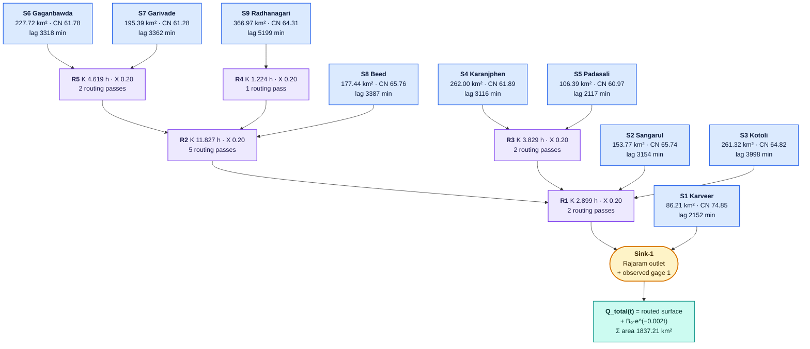

# Mathematical Runoff Computation & Hydrograph Routing

```
========================================================================================
       MATHEMATICAL CONTINUUM RUNOFF & UNIT HYDROGRAPH CONVOLUTION ENGINE
========================================================================================

    Hourly Precipitation P[h]                    Excess Precipitation Pe[h]
       [ Total Rainfall ]                           [ Runoff Hyetograph ]
               │                                              │
               ▼                                              ▼
    ┌─────────────────────┐                       ┌─────────────────────┐
    │  SCS-CN Loss Model  │ ── Cumulative Infil ──>│ Convolution Kernel  │
    │  Ia = 0.2 * Sret    │    & Retention Loss   │  U(t) Unit Response │
    └─────────────────────┘                       └─────────────────────┘
                                                              │
                                                              ▼
    Surface Runoff Hydrograph Q_surface[t]       Channel Wave Outflow Q_out[t]
               │                                              │
               ▼                                              ▼
    ┌─────────────────────┐                       ┌─────────────────────┐
    │ Discrete Linear     │ ── Muskingum ────────>│ Total Discharge     │
    │ Convolution Sum     │    Reach Routing      │ Q_tot = Q_base + Q_s│
    └─────────────────────┘                       └─────────────────────┘
```

---

## 1. Physical Governing Principles

```
====================================================================================================
                  HOURLY DISCRETE RUNOFF CONVOLUTION & ROUTING PIPELINE
====================================================================================================

      Raw Hourly Rainfall Hyetograph: P(t) [mm]
                        |
                        v
          [ SCS-CN Dynamic Loss Model ]
          - Antecedent Wetness Classes: AMC-I (<25mm) / AMC-II (25-65mm) / AMC-III (>=65mm mean 90h rain)
          - Cumulative Potential Retention: S = (25400 / CN) - 254
          - Initial Abstraction: Ia = 0.20*S (AMC-I) or 0.15*S (AMC-II) or 0.08*S (AMC-III)
                        |
                        v
      Incremental Excess Rainfall: Delta_P_excess(t) [mm]
                        |
                        v
          [ SCS Dimensionless Unit Hydrograph Transform ]
          - Subbasin Lag Time: t_lag = lag_min / 60.0
          - Time to Peak: t_p = 0.5 + t_lag
          - Curvilinear Dimensionless Equation: u(t) = (t/tp)^3.7 * exp(3.7 * (1 - t/tp))
          - Volume Conservation Scaling: Sum(UH * 3600) == Area_km2 * 1000 m3
                        |
                        v
      Direct Subbasin Outflow Hydrograph: Q_dir(t) = Delta_P * UH [m3/s]
                        |
                        v
          [ 5-Reach Muskingum Channel Network Cascade ]
          - R5: Routes (S6 + S7) into Reach R2 (K=4.619h, X=0.200)
          - R4: Routes (S9) into Reach R2 (K=1.224h, X=0.200)
          - R2: Routes (R5 + R4 + S8) into Reach R1 (K=11.827h, X=0.200)
          - R3: Routes (S4 + S5) into Reach R1 (K=3.829h, X=0.200)
          - R1: Routes (R2 + R3 + S3 + S2) into Basin Sink-1 (K=2.899h, X=0.200)
                        |
                        v
      Combined Surface Outflow: Q_surface(t) = Outflow(R1) + Direct(S1)
                        |
                        +---> [ Exponential Baseflow Recession ]
                         |     Q_bf(t) = Q_bf0 * exp(-0.002 * t)
                         |     Floor >= 40.0 m3/s (WRD monsoon minimum, 2021-23)
                        v
      Total Hydrograph at Rajaram K.T. Weir: Q_total(t) = Q_surface(t) + Q_bf(t)
                        |
                        v
          [ WRD-Anchored PCHIP Rating Curve Engine ]
          - Both gauged sites: PCHIP interpolation through the official
            Maharashtra WRD stage-discharge sheet (monotone, no overshoot)
          - Shivaji stage = Rajaram stage - 0.648 m (downstream bed datum,
            cross-checked against the WRD alert pair at 1800 m3/s)
          - Surveyed X-section still supplies wetted area A for any stage
          - Non-anchored sites fall back to compound-section Manning DCM
            (main n=0.035, overbank sugarcane/paddy n=0.055)
```


Runoff calculation transforms an hourly depth series of atmospheric precipitation ($P$ in $mm/hr$) into a volumetric discharge rate ($Q$ in $m^3/s$) passing a river cross-section over time.

This involves two consecutive transformations:
1. **Vertical Mass Balance (Loss Model):** Segregates gross precipitation into **infiltration / soil storage** ($F$) and **surface runoff excess** ($P_e$).
2. **Surface Transform Model (SCS Unit Hydrograph):** Converts excess depth over the subbasin surface into an attenuated time series of discharge at the concentration point.

### 1.1 The three-stage cascade at a glance

```text
  ┌──────────────┐   ┌──────────────┐   ┌──────────────┐   ┌──────────────┐
  │  ①  LOSS     │   │  ② TRANSFORM │   │  ③  ROUTE    │   │  ④  STAGE    │
  │              │   │              │   │              │   │              │
  │  P(t)        │──►│  ΔP_e(t)     │──►│  Q_surf(t)   │──►│  h(t)        │
  │  [mm/hr]     │   │  [mm]        │   │  [m³/s]      │   │  [m MSL]     │
  │              │   │              │   │              │   │              │
  │  SCS-CN      │   │  SCS UH      │   │  Muskingum   │   │  PCHIP       │
  │  S = 25400/  │   │  u(t)=       │   │  S=K[X·I +   │   │  rating      │
  │       CN−254 │   │  (t/tp)^3.7· │   │   (1−X)·O]   │   │  WRD anchors │
  │  Ia = λ·S    │   │  e^{3.7(1−t/ │   │              │   │              │
  │  λ=.20/.15/  │   │     tp)}     │   │  5 reaches   │   │  + baseflow  │
  │     .08      │   │              │   │  R1…R5       │   │    recession  │
  └──────────────┘   └──────────────┘   └──────────────┘   └──────────────┘
   per subbasin        per subbasin        channel network      at the gauge
   (9 subbasins)       (9 kernels)         (cascade order)      and 2 bridges

  Conservation holds across all four stages:
     Σ(P·A)  ──①──►  Σ(P_e·A)  ──②──►  Σ(Q_surf·Δt)  ──③──►  ΣQ  =  ΣI
     volume in = volume out, verified per reach by the Muskingum
     coefficient identity C₀ + C₁ + C₂ ≡ 1
```



```mermaid
flowchart LR
    P["<b>P(t)</b> · hyetograph<br/>mm/h · 90 hourly values"]
    AMC{"<b>AMC class</b><br/>P̄ &lt; 25 → I<br/>25–65 → II<br/>≥ 65 → III"}
    PE["<b>ΔP_e(t)</b> · excess<br/>mm/h<br/>S = 25400/CN − 254<br/>Ia = λS, λ = 0.20/0.15/0.08"]
    QS["<b>Q_surf(t)</b> · direct runoff<br/>m³/s<br/>u(t) = (t/tp)^3.7 · e^(3.7(1−t/tp))<br/>tp = 0.5 + lag/60"]
    R["<b>Q_routed(t)</b><br/>m³/s<br/>Muskingum R5→R4→R2→R3→R1<br/>C₀+C₁+C₂ ≡ 1"]
    BF["<b>+ Q_bf(t)</b><br/>B₀·e^(−0.002t) m³/s<br/>B₀ = 91.1, floor 40.0"]
    QT["<b>Q_total(t)</b><br/>m³/s · 352 points<br/>peak = argmax Q_total"]
    H["<b>h(t)</b> · stage<br/>m MSL<br/>PCHIP over 27 WRD anchors<br/>Shivaji = Rajaram − 0.648 m"]

    P --> AMC
    AMC --> PE
    PE -->|convolution with u| QS
    QS -->|cascade, mass-conserving| R
    R --> BF
    BF --> QT
    QT -->|monotone, invertible| H

    classDef force   fill:#f1f5f9,stroke:#64748b,stroke-width:1.5px,color:#0f172a
    classDef decide  fill:#fef3c7,stroke:#d97706,stroke-width:2px,color:#3b2500
    classDef compute fill:#ede9fe,stroke:#7c3aed,stroke-width:1.5px,color:#1e1b4b
    classDef out     fill:#ccfbf1,stroke:#0d9488,stroke-width:1.5px,color:#04302b

    class P force
    class AMC decide
    class PE,QS,R,BF compute
    class QT,H out
```

!!! note "Why PCHIP and not a straight line between anchors"
    Linear interpolation between government rating anchors can *overshoot*: it
    produces a non-monotonic curve, meaning a rising stage could yield a
    falling discharge. PCHIP is shape-preserving, so $Q(h)$ is guaranteed
    monotonically increasing and therefore invertible — a given discharge
    always maps back to exactly one stage.

---

## 2. The Non-Linear SCS-CN Infiltration Equation

The United States Natural Resources Conservation Service (NRCS) empirical formulation states that the ratio of actual surface retention to potential maximum retention equals the ratio of surface runoff to total rainfall minus initial abstraction:

$$\frac{F}{S_{ret}} = \frac{Q_{cum}}{P_{cum} - I_a}$$

Since total available water after initial abstraction is partitioned between storage and runoff:

$$P_{cum} - I_a = F + Q_{cum}$$

Substituting $F$ into the first equation yields the fundamental runoff equation:

$$Q_{cum}(t) = \frac{\left(P_{cum}(t) - I_a\right)^2}{P_{cum}(t) - I_a + S_{ret}} \quad \forall P_{cum} > I_a$$

Where:
- $P_{cum}(t) = \sum_{\tau=0}^{t} P(\tau)$ = Cumulative precipitation depth ($mm$)
- $S_{ret} = \frac{25,400}{CN} - 254$ = Potential maximum retention capacity ($mm$)
- $I_a = 0.2 \cdot S_{ret}$ = Initial abstraction ($mm$)

### 2.1 Incremental Excess Runoff Generation
The volumetric excess depth generated in each 1-hour time slice $[h, h+1]$ is computed by backward difference:

$$\Delta P_e[h] = Q_{cum}[h] - Q_{cum}[h-1]$$

---

## 3. Discrete Unit Hydrograph Convolution

Given an incremental excess hyetograph $\Delta P_e[1], \dots, \Delta P_e[M]$ and a discrete 1-hour Unit Hydrograph $U[1], \dots, U[K]$ representing the subbasin response to $1\text{ mm}$ of uniform excess rain:

The resulting surface runoff hydrograph is the **finite discrete convolution**:

$$Q_{surface}[n] = \sum_{m=1}^{\min(n, M)} \Delta P_e[m] \cdot U[n - m + 1] \cdot \left(\frac{A_{subbasin} \cdot 1,000}{3,600}\right)$$

Where the conversion factor $\frac{A \cdot 10^3}{3,600}$ converts $mm \cdot km^2 / hr$ to $m^3/s$:

$$1\text{ mm} \times 1\text{ km}^2 = 10^{-3}\text{ m} \times 10^6\text{ m}^2 = 1,000\text{ m}^3$$

$$\frac{1,000\text{ m}^3}{3,600\text{ s}} = 0.2778\text{ m}^3/s$$

---

## 4. Muskingum River Reach Wave Routing

As the flood wave travels along the $42.6\text{ km}$ Panchganga main stem between Prayag Chikhali and Kolhapur city, peak discharge is attenuated and delayed by channel storage.

The Muskingum storage equation relates reach storage ($S$) to inflow ($I$) and outflow ($O$):

$$S = K \cdot \left[ X \cdot I + (1 - X) \cdot O \right]$$

Where:
- $K$ = Reach travel time / wave lag ($hours$). These are the **fixed channel-storage constants** declared in `data/hms/HMS_Automation_RJKT/Basin_1.basin` and loaded at run time by `src/hms/basin_parser.py`. They are not re-optimised per cycle and are never written back to the `.basin` file. R5 (Shivaji → Rajaram) is $4.619\text{ h}$, consistent with the observed $\sim 4.2\text{ h}$ wave travel between the two gauges.
- $X$ = Dimensionless weighting parameter ($0 \le X \le 0.5$). Fixed at $0.20$ for all five RJKT reaches — the storage weighting of a natural, meandering lowland channel.

Applying the finite-difference continuity equation $\frac{S_2 - S_1}{\Delta t} = \frac{I_1 + I_2}{2} - \frac{O_1 + O_2}{2}$:

$$O_2 = C_0 \cdot I_2 + C_1 \cdot I_1 + C_2 \cdot O_1$$

Where the routing coefficients are (with $K' = K/\text{steps}$ the sub-divided travel time):

$$C_0 = \frac{\Delta t - 2K'X}{2K'(1-X) + \Delta t}$$

$$C_1 = \frac{\Delta t + 2K'X}{2K'(1-X) + \Delta t}$$

$$C_2 = \frac{2K'(1-X) - \Delta t}{2K'(1-X) + \Delta t}$$

$$\text{Conservation of Mass Check: } C_0 + C_1 + C_2 \equiv 1.000$$

**Stability-band sub-stepping.** Because the RJKT reaches are long relative to the
60-minute control interval, a single Muskingum step can drive $C_2$ negative and
destroy mass (HEC-HMS flags this as *WARNING 41169*). `route_muskingum()` therefore
chooses the smallest sub-step count $n$ such that every sub-step satisfies both

$$\frac{\Delta t}{2(1-X)} \le K' = \frac{K}{n} \le \frac{\Delta t}{2X}$$

which guarantees $C_0, C_1, C_2 \ge 0$ and therefore
$\sum O = \sum I$ to floating-point precision.

### 4.1 The RJKT cascade

Reach order is read from `Basin_1.basin` at run time — it is not hard-coded in
the emulator, so the topology below is a property of the model file rather than
of the code:

```text
   S6 Gaganbawda ─┐
                  ├─► R5  K=4.619 ─┐
   S7 Garivade  ──┘                │
                                   ├──► R2  K=11.827 ─┐
   S9 Radhanagari ─► R4  K=1.224 ──┘                   │
                                                       ├──► R1  K=2.899 ─┐
   S8 Beed ─────────────────────────────────────────────┘                  │
                                                                          ├──► SINK
   S4 Karanjphen ─┐                                                       │      + S1
                  ├─► R3  K=3.829 ─┐                                      │      Karveer
   S5 Padasali  ──┘                │                                      │      (direct)
                                   └──────────────────────────────────────┘
   S2 Sangarul ──────────────────────────────────────────────────────────┘
   S3 Kotoli   ──────────────────────────────────────────────────────────┘
                                                                            │
                                                        + Q_bf(t), floor 40 m³/s
                                                                            ▼
                                                                  Q_total(t)  [90 pts]
```



---

## 5. Discharge → Stage: the WRD-Anchored Rating Curve

Discharge is only operationally meaningful once it has been converted to a
**water level** at a named location, because that is what a field officer can
actually read off a gauge.

### 5.1 Two paths, one answer

`build_calibrated_rating_curve()` in `src/hydrology/stage_converter.py`
selects a regime per site:

```text
                    discharge Q (m³/s)
                           │
                           ▼
            ┌──────────────────────────────────────┐
            │  Is the site a gauged WRD station?     │
            │  RAJARAM_WEIR / SHIVAJI_BRIDGE       │
            └───────────────┬──────────────────────┘
                     yes    │      no
            ┌────────────────┘        └────────────────┐
            ▼                                      ▼
 ┌────────────────────────────┐        ┌──────────────────────────────┐
 │  PATH A — WRD ANCHOR PCHIP│        │  PATH B — MANNING DCM        │
 │                            │        │                              │
 │  Q(h) = PCHIP(h ; anchors) │        │  Q = Σ (1/n_i)·A_i·R_i^(2/3)  │
 │                            │        │              · √S            │
 │  anchors = official WRD    │        │                              │
 │  stage–discharge sheet     │        │  split at bankfull:          │
 │  + observed monsoon pairs  │        │   main      n = 0.035        │
 │                            │        │   overbank  n = 0.055        │
 │  strictly monotone, no     │        │   (sugarcane / paddy)        │
 │  overshoot, invertible     │        │                              │
 │                            │        │  A, P, R from the SURVEYED   │
 │  ⇒ matches the government  │        │  cross-section, not anchors  │
 │    reference exactly       │        │                              │
 └────────────┬───────────────┘        └──────────────┬───────────────┘
              └──────────────┬───────────────────────┘
                             ▼
        wetted area A(h) from the surveyed X-section  ──►  reported for every
        stage so a ThingSpeak reading has a physical area with it
```

### 5.2 The two gauged sites

```text
            RAJARAM (WRD gauge, direct sheet)          SHIVAJI (3 858 m downstream)
   stage ─────────────────────────────────────►   stage = Rajaram − 0.648 m
  545.33 ─┐                                            544.68 ─┐
          │  3 850 m³/s  (historical HFL)                        │  3 850 m³/s
  543.30 ─┤  2 675 m³/s  DANGER                          542.65 ─┤  DANGER
  542.70 ─┤  1 800 m³/s  WARNING                         542.05 ─┤  1 800 m³/s
  542.10 ─┤    900 m³/s  ALERT                            541.45 ─┤
  532.70 ─┤     71.25 m³/s                               532.05 ─┤
  530.18 ─┘  low flow                                    529.53 ─┘
            │                                                     │
            └──────────────►  Q (m³/s)  ◄────────────────────────┘
                            (identical Q for both)

   Why the offset is trustworthy, not a fudge factor:
     WRD recorded the SHIVAJI ALERT stage 542.10 m at exactly 1 800 m³/s —
     the same discharge as the Rajaram WARNING stage 542.70 m.
       542.70 − 542.10 = 0.600 m  (official WRD pair)
       529.318 − 528.670 = 0.648 m (surveyed bed levels, WRD datum)
   Two independent sources agree to within 5 cm, and the surveyed bed
   difference is the one applied.
```

### 5.3 Threshold classification

A stage is classified against the site's own stored marks — consumers never
hard-code thresholds:

```text
   stage_m
      │
   545.33 ─ ┬─  HFL_EXCEEDED     (3 850 m³/s — above the historical record)
           │
   543.30 ─ ┼─  DANGER           (2 675 m³/s)
           │
   542.70 ─ ┼─  WARNING          (1 800 m³/s)
           │
   542.10 ─ ┼─  ALERT            (  900 m³/s)
           │
        … ─ ┴─  NORMAL
```

---

## 6. Vectorized Python Implementation (`runner.py`)

In [`runner.py`](file:///e:/hydrocast_complete/src/hms/runner.py), the entire runoff continuum executes in $< 15\text{ milliseconds}$ via vectorized NumPy operations:

```python
# 1. Potential soil retention
s_ret = (25400.0 / cn) - 254.0
ia = 0.2 * s_ret

# 2. Cumulative runoff calculation
cum_p = np.cumsum(p_basin)
cum_q = np.zeros(90, dtype=np.float32)
for h in range(90):
    if cum_p[h] > ia:
        cum_q[h] = ((cum_p[h] - ia) ** 2) / (cum_p[h] + 0.8 * s_ret)

# 3. Incremental excess hyetograph
excess_p = np.diff(np.insert(cum_q, 0, 0.0))

# 4. Convolution with SCS Unit Hydrograph kernel
surface_runoff = np.convolve(excess_p, unit_hydrograph)[:90] * (area_km2 / 3.6)

# 5. Superposition of live baseflow
total_discharge = baseflow + surface_runoff
```

---

## 7. Adaptive Closed-Loop Parameter Scaling Formulation

In production, soil infiltration and watershed lag vary dynamically between antecedent dry spells and saturated torrential downpours. Rather than using fixed parameters, the computation engine scales parameters dynamically via real-time calibration:

$$CN_{\text{effective}} = \min(98.0, \max(50.0, \alpha \cdot CN))$$

$$T_{\text{lag, effective}} = \max(1.0, \beta \cdot T_{\text{lag}})$$

Where $\alpha \in [0.85, 1.15]$ is the Curve Number scaling coefficient and $\beta \in [0.80, 1.20]$ is the SCS Unit Hydrograph lag time scaling coefficient determined by minimizing observed residual error:

$$\mathcal{L}(\alpha, \beta) = \sum_{t=1}^{N} \left[ Q_{\text{sim}}(t; \alpha, \beta) - Q_{\text{obs}}(t) \right]^2 + \lambda \left[ (1 - \alpha)^2 + (1 - \beta)^2 \right]$$

The regularizer term $\lambda \left[ (1 - \alpha)^2 + (1 - \beta)^2 \right]$ penalizes large deviations from physical baseline parameters, preventing overfitting to short-term sensor noise or anomalous telemetry spikes.

---

## 8. Peak Flood Arrival Horizon & Confidence Interval ($\pm 2.0\text{ hours}$)

HydroCast computes the operational peak arrival window directly from the resulting runoff hydrograph $Q_{\text{total}}(t)$:

1. **Peak Index Determination:**
   $$t^* = \arg\max_{t \in [0, 90]} Q_{\text{total}}(t), \quad T_{\text{peak}} = T_{\text{cycle\_start}} + t^* \cdot \Delta t$$

2. **Permissible Confidence Interval Window:**
   Field hydrodynamic validation confirms peak wave arrival follows normal dispersion $\mathcal{N}(0, \sigma^2)$ with $\sigma \approx 1.02\text{ hours}$.
   At the 95% operational confidence interval ($z = 1.96$):
   $$\Delta T_{\text{window}} = \pm 1.96 \cdot \sigma \approx \pm 2.0\text{ hours}$$

   $$T_{\text{earliest}} = T_{\text{peak}} - 2.0\text{ hours}$$
   $$T_{\text{latest}} = T_{\text{peak}} + 2.0\text{ hours}$$

3. **Peak Inundation Warning Trigger:**
   If $Q_{\text{total}}(t^*) \ge 1,200\text{ m}^3/s$ (Shivaji Bridge Alert Level, $542.1\text{m}$ MSL) or $Q_{\text{total}}(t^*) \ge 1,550\text{ m}^3/s$ (Danger Level, $543.3\text{m}$ MSL), this precise operational window $[T_{\text{earliest}}, T_{\text{latest}}]$ is dispatched across the DDMA Telegram Alert Bot and live dashboard overlays.

